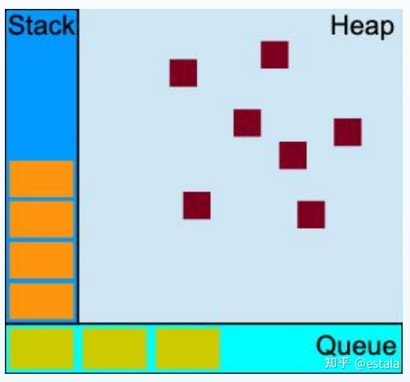

# js任务队列 
还记得去年毕业的时候，一位面试官跟我讨论起js单线程的这些特点，记得当时上来就是问，为什么js是单线程？年幼无知的我满脑子都是问好， 我怎么知道？这不就是当时作者写的时候设计的时候就是这样子设计的吗？随后听完了面试官的解释也是牢记到了现在，今天真好看到了相关的一些文章，便更深层次的记录下自己所学到的知识点：

JS作为浏览器的脚本语言，主要的用途就是与用户互动，操作dom，这也是根本原因决定JS是单线程的原因。 设想一个线程在DOM上添加元素，而另一个线程删除了这个节点，那这个时候应该听谁的？

单线程，也就是说，所有的任务都需要排队来让线程依次执行，如果遇到耗时任务，那队伍中剩下的任务都要等着任务处理结束。所以JS的作者就设计了同步/异步任务来提高运行效率。

同步任务：在主线程上等待执行任务，前一个结束后一个才会执行。

异步任务：不进入主线程，进入任务队列，等待任务队列通知主线程，某个异步任务可以执行了，这个任务才可以进入主线程执行。

可以从这张单线程模型图上重新理解一下：

程序在运行的过程会产生堆(heap，存放对象，数据，垃圾回收就是这里)和栈(stack)

所有任务都会在主线程上执行，形成一个执行栈(execution stack)---先进后出

除了主线程，还有一个任务队列(task queue)，只要异步任务有了运行结果，就会在任务队列中放置一个事件---先进先出

当stack中的所有同步任务执行完毕，就会来读取queue，对应的异步任务就会结束等待状态，进入执行栈，开始执行

重复以上三个步骤

注意：任务队列是一个事件的队列，IO设备完成一项任务，就会在任务队列中添加一个事件，表示相关异步任务可以进入执行栈了。主线程读取的就是这里面的事件。

除了IO设备的事件以外，还有一些用户产生的事件（点击滚动等）， 通过指定过回调函数，这些事件发生时就会进入任务队列，等待主线程读取。

回调函数，说的就是被挂起来的代码，异步任务必须指定回调函数，当主线程开始执行异步任务，就是执行异步任务的回调函数

Js 中，有两类任务队列：宏任务队列（macro tasks）和微任务队列（micro tasks）。宏任务队列可以有多个，微任务队列只有一个。

宏任务：script（全局任务）, setTimeout, setInterval, setImmediate, I/O, UI rendering.

微任务：process.nextTick, Promise, Object.observer, MutationObserver.