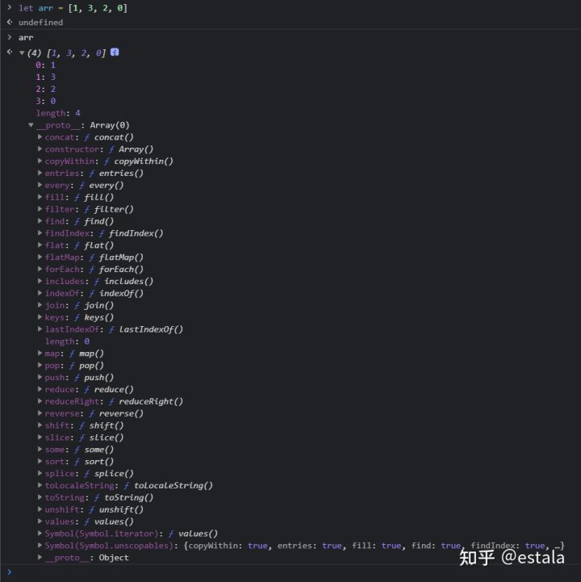
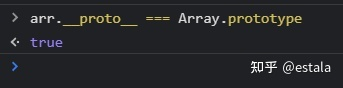
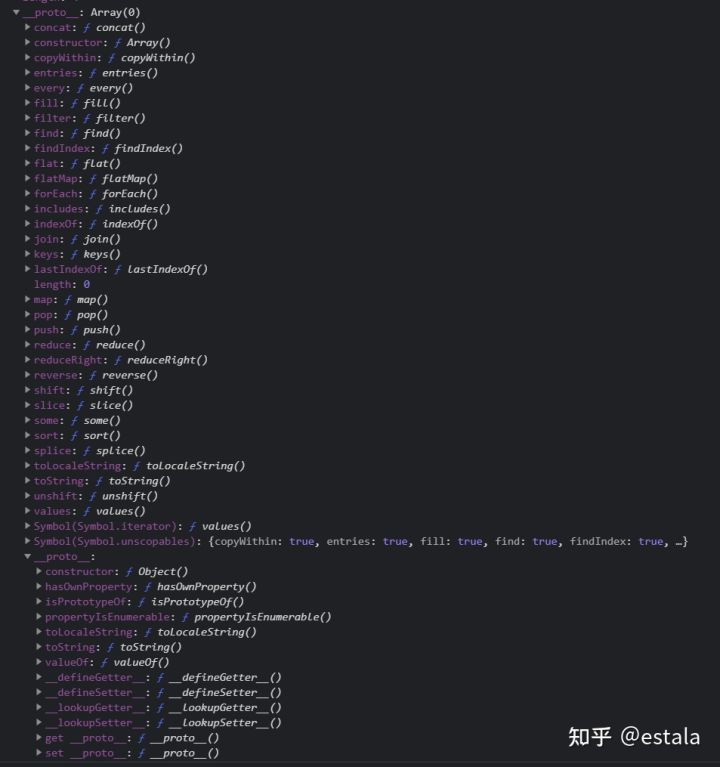

# 最近随手记

- 最近使用了阿里巴巴的矢量图标库iconfont的Symbol模式，非常简单好用，还是值得推荐

- 想画圆弧 除了使用border-radius  还可以用clip-path ellipse(80% 60% at 50% 40%)

- 写css渐变可以搜索 css gardient 来生成代码

- 复习grid布局发现grid-template-area 很好用

- vue3 用 js获取插槽内容  context.slots.defaults()

- 在onMount里面用watchEffect相当于 onMounted 和onUpdated时调用

- getBoundingClientRect()除了width height, 其他x,y top, bottm, left, rigth都是获取相对于左上角的距离

- {left:left} 析构赋值的重命名

- ts中非空判断 ?. === &&

# js任务队列 
还记得去年毕业的时候，一位面试官跟我讨论起js单线程的这些特点，记得当时上来就是问，为什么js是单线程？年幼无知的我满脑子都是问好， 我怎么知道？这不就是当时作者写的时候设计的时候就是这样子设计的吗？随后听完了面试官的解释也是牢记到了现在，今天真好看到了相关的一些文章，便更深层次的记录下自己所学到的知识点：

JS作为浏览器的脚本语言，主要的用途就是与用户互动，操作dom，这也是根本原因决定JS是单线程的原因。 设想一个线程在DOM上添加元素，而另一个线程删除了这个节点，那这个时候应该听谁的？

单线程，也就是说，所有的任务都需要排队来让线程依次执行，如果遇到耗时任务，那队伍中剩下的任务都要等着任务处理结束。所以JS的作者就设计了同步/异步任务来提高运行效率。

同步任务：在主线程上等待执行任务，前一个结束后一个才会执行。

异步任务：不进入主线程，进入任务队列，等待任务队列通知主线程，某个异步任务可以执行了，这个任务才可以进入主线程执行。

可以从这张单线程模型图上重新理解一下：


程序在运行的过程会产生堆(heap，存放对象，数据，垃圾回收就是这里)和栈(stack)

所有任务都会在主线程上执行，形成一个执行栈(execution stack)---先进后出

除了主线程，还有一个任务队列(task queue)，只要异步任务有了运行结果，就会在任务队列中放置一个事件---先进先出

当stack中的所有同步任务执行完毕，就会来读取queue，对应的异步任务就会结束等待状态，进入执行栈，开始执行

重复以上三个步骤

注意：任务队列是一个事件的队列，IO设备完成一项任务，就会在任务队列中添加一个事件，表示相关异步任务可以进入执行栈了。主线程读取的就是这里面的事件。

除了IO设备的事件以外，还有一些用户产生的事件（点击滚动等）， 通过指定过回调函数，这些事件发生时就会进入任务队列，等待主线程读取。

回调函数，说的就是被挂起来的代码，异步任务必须指定回调函数，当主线程开始执行异步任务，就是执行异步任务的回调函数

Js 中，有两类任务队列：宏任务队列（macro tasks）和微任务队列（micro tasks）。宏任务队列可以有多个，微任务队列只有一个。

宏任务：script（全局任务）, setTimeout, setInterval, setImmediate, I/O, UI rendering.

微任务：process.nextTick, Promise, Object.observer, MutationObserver.

# 用flex做导航栏的方法
用flex时注意看要求是什么？

在logo居中的情况下：

 1. 假如左右两边的导航栏个数相同，给logo添加
`flex: 1`
就可以让logo 占据多余的空间，然后让其余标签分散开就好。

因为加入标签个数不一样的话，会让logo不是居中的，它仅仅会计算多余的空间，然后在计算出的长度居中。

2. 假如导航栏左右的菜单不是相同个数，解决方案是用div分开左中右，然后给flex container中的item 分别设置 

```
text-align: left | center | right；
flex：3
```

就可以设计出一个左中右布局的导航栏。 这个时候

`justify-content: flex-start | center | flex-end`

给什么值都可以。


小技巧：

用a做标签时，可以用padding来增大可点击范围，否则仅仅字体可点击会增加用户选择的难度。

# js原型链
今天复习一下js中的原型链~

对于如下代码，调用arr.reverse()的时候会让数组实现逆序排，调用arr.toString()会用字符串形式展示数组内容。

那么问题来了，arr的reverse方法是在哪里定义的？toString方法是哪里定义的？

```
let arr = [1, 3, 2, 0]
arr.reverse()
arr.toString()
```
在控制台中打印出我们这个array，展开后观察_proto_:



可以看到这个array的实例的原型上，继承了Array的prototype，可以简单的通过下图验证：



也就是说，所有的函数都包含一个.prototype属性，可以理解成一个空对象，当去用这个函数new一个对象时，这个新对象的__proto__属性都会指向函数的prototype属性

使用这个对象时，它会先从自由属性开始找，找不到再从._proto__中去找。

所以reverse就是在Array函数的原型链上

但是toString呢？



当继续展开后发现：

Array函数的._proto_是一个普通对象，是由new Object函数创建的，toString其实来源于这里。

toString来自于对象函数的原型链上

instanceof 这个函数就是用于检测构造函数的prototype属性是不是出现在某个实例对象的原型链上。几个验证：

[] instanceof Array // true

{} instanceof Object //true

(function(){}) instanceof Function //true

Object instanceof Function // true

总结

原型链的本质就是链表，原型链上的节点是各种原型对象， 比如 Function.prototype, Object.prototype, Array.prototype....

原型链就是通过__proto__属性链接各种原型对象。

所有实例都是先指向自己类型的原型链， 然后指向对象原型链，最后再指向空

obj -> Object.prototype -> null

func -> Function.prototype -> Object.prototype -> null

arr -> Array.prototype -> Object.prototype -> null

Add：

```
Object instanceof Function
true
Function instanceof Object
true
```

Object, Function, Array等等这些都被称作是构造“函数”，他们都是函数。而所有的函数都是构造函数Function的实例。从原型链机制的的角度来说，那就是说所有的函数都能通过原型链找到创建他们的Function构造函数的构造原型Function.protorype对象