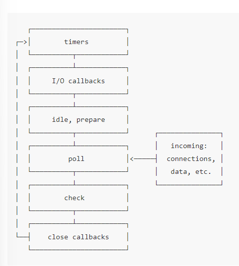

# NodeJS 

- NodeJS 不是一个Web后端框架， 不能对比flask/sping

- 不是一个编程语言， 不能与python/php对比
- nodeJS是一个平台， 集成了多种技术
  

## NodeJS 架构
Node.js主要分为四大部分，Node Standard Library，Node Bindings，V8，Libuv，架构图如下:

- Node Standard Library 是我们每天都在用的标准库，如Http, Buffer 模块。
- Node Bindings 是沟通JS 和 C++的桥梁，封装V8和Libuv的细节，向上层提供基础API服务。
    - 这一层是支撑 Node.js 运行的关键，由 C/C++ 实现。
    - V8 是Google开发的JavaScript引擎，提供JavaScript运行环境，可以说它就是 Node.js 的发动机。
    - Libuv 是专门为Node.js开发的一个封装库，提供跨平台的异步I/O能力.
    - C-ares：提供了异步处理 DNS 相关的能力。
    - http_parser、OpenSSL、zlib 等：提供包括 http 解析、SSL、数据压缩等其他的能力。

### V8是什么
#### 功能
- 将JS源代码变为本地代码并执行
- 维护调用栈，确保JS函数的执行顺序
- 内存管理，为所有对象分配内存
- 垃圾回收， 重复利用无用的内存
- 实现js的标准库

#### 注意
- V8不提供DOM API
- V8 执行JS是单线程的
- 可以开启两个线程 分别执行JS
- V8 本身是包含多个线程的， 如垃圾回收为单独线程
- 自带 eventloop 但nodejs基于libuv自己做了一个

### 什么是eventloop

#### 什么是Event
- 计时器到了 `setTimeout(f1, 100)`
- 文件可以读取了， 读取出错了  `fs.readFile("./1,txt", f2)`
- socket 有内容了， 关闭了 ` server.on('close', f3)`

##### 如果同时触发， Node会怎么办
- 肯定有某种顺序（优先级）
- 这种顺序应该人为规定

#### 什么是Loop
- loop是循环
- 因为事件是有优先级的，所以处理起来也是分先后的
- 所以nodejs会顺序轮询每种事件
- 轮询是循环的。 1->2->3->1->2->3

#### EventLoop
- 操作系统可以触发事件， JS可以处理事件
- EventLoop 就是对事件处理顺序的管理。

- **timers 阶段**：这个阶段执行 setTimeout 和 setInterval 的回调函数。(多长时间后可以执行回调函数)
- I/O callbacks 阶段：不在 timers 阶段、close callbacks 阶段和 check 阶段这三个阶段执行的回调，都由此阶段负责，这几乎包含了所有回调函数。
- idle, prepare 阶段（译注：看起来是两个阶段，不过这不重要）：event loop 内部使用的阶段（译注：我们不用关心这个阶段）
- **poll 阶段**：获取新的 I/O 事件。在某些场景下 Node.js 会阻塞在这个阶段。
- **check 阶段**：执行 setImmediate() 的回调函数。
- close callbacks 阶段：执行关闭事件的回调函数，如 socket.on('close', fn) 里的 fn。

#### 注意：
- 大部分事件nodejs都停在poll轮询阶段
- 大部分事件都在poll阶段被处理（文件/网络请求）

### 总结：
- 用libuv进行异步I/O操作
- 用event loop管理事件处理顺序
- 用C/C++处理DNS/HTTP
- 用bindings让JS和C/C++沟通
- V8运行JS
- 用NodeJS简化JS代码

## file文件系统
