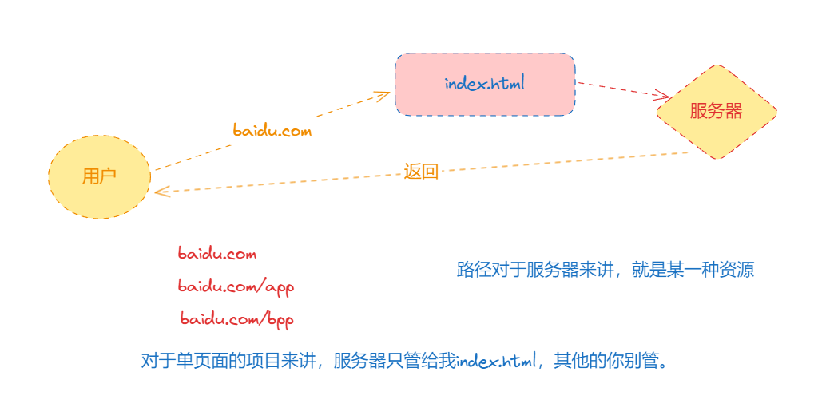
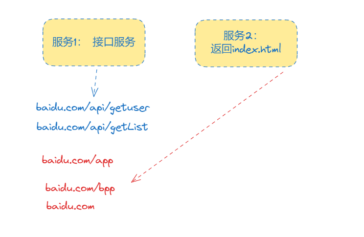
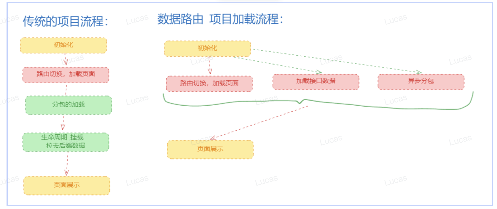

React router

# react router

# react-router 和 react-router-dom 这个库的区别？

react-router-dom（浏览器专用）内部实际上依赖 react-router 这个库的。

# 如何实现组件懒加载 (开启分包)

`React.lazy(() => import('././component.ts'))`

# 如何做组件加载过程中统一的 Loading

`<Suspense fallback={<Loading />}></Suspense>`

# 单页面和多页面的区别

## 多页面

- 多页面实际就是多个 html， 通过 window.location 相互跳转
- 缺点：每个页面跳转都要刷新， 重新加载资源， 性能比较慢
- 优点： seo 友好， c 端， 隔离性好， 每一个页面是一个独立的项目

## 单页面

- 好处：在一个 html 中进行路由跳转，实际上是通过 js 去控制的。代表性的框架 react/vue。比较适合 B 端的项目，不考虑 SEO。
- 页面跳转不用刷新，性能会好一些，用户体验也能好，可以实现代码复用。
- 缺陷： SEO 不好

## BrowserRouter（99%）

- 后台做一些配置
- 问题： browserRouter 在使用的时候会遇到 404 的问题/BrowserRouter 配置过程中有没有遇到过一些坑？
  需要后台配合，否则会出现 404 的问题。
  服务端使用：

1. 正则匹配
2. 通配符
   
   

```
import React from 'react';
import ReactDOM from 'react-dom/client';
import './index.css';
import App from './App';
import { BrowserRouter, Route, Routes } from 'react-router-dom'

const root = ReactDOM.createRoot(document.getElementById('root'));

function Bpp () {
  return (
    <h1>bpp</h1>
  )
}

root.render(
  <BrowserRouter basename='pc'>
    <Routes>
      <Route path="/app" element={<App />} />
      <Route path="/bpp" element={<Bpp />} />
    </Routes>
  </BrowserRouter>
);

```

## HashRouter

- 了解即可，非必要不要使用这种方式
  缺陷：

1. 很丑
2. 后期要改造服务端渲染很不方便

## MemoryRouter

内存型路由
应用场景： 单测

```
import * as React from "react";
import { create } from "react-test-renderer";
import {
  MemoryRouter,
  Routes,
  Route,
} from "react-router-dom";

describe("My app", () => {
  it("renders correctly", () => {
    let renderer = create(
      <MemoryRouter initialEntries={["/users/mjackson"]}>
        <Routes>
          <Route path="users" element={<Users />}>
            <Route path=":id" element={<UserProfile />} />
          </Route>
        </Routes>
      </MemoryRouter>
    );

    expect(renderer.toJSON()).toMatchSnapshot();
  });
});
```

## NativeRouter

```
import * as React from "react";
import { NativeRouter } from "react-router-native";

function App() {
  return (
    <NativeRouter>
      {/* The rest of your app goes here */}
    </NativeRouter>
  );
}
```

## StaticRouter

静态路由

```
import * as React from "react";
import * as ReactDOMServer from "react-dom/server";
import { StaticRouter } from "react-router-dom/server";
import http from "http";

function requestHandler(req, res) {
  let html = ReactDOMServer.renderToString(
    <StaticRouter location={req.url}>
      {/* The rest of your app goes here */}    </StaticRouter>
  );

  res.write(html);
  res.end();
}

http.createServer(requestHandler).listen(3000);
```

## outlet

子页面的占位符。
我们要实现通用的 header，就是用这个玩意。

## useLocation || useNavigate

可以获取一些 navigate 路由过来的状态
navigate(-1) 返回上一个路径

```
import { Outlet, useNavigate } from "react-router-dom"

function Layout () {

    const navigate = useNavigate()

    console.log('navigate',navigate )

    return (
        <div>
            <h1>我是通用的头部</h1>
            <button onClick={() => navigate('/app')}>跳转到App</button>

            <button onClick={() => navigate('/bpp', {
                state: {
                    user_id: 'james',
                    from: 'layout'
                }
            })}>跳转到bpp</button>
            <Outlet />
        </div>
    )
}

export default  Layout
```

## 动态路由

useParams

```
import React from 'react';
import ReactDOM from 'react-dom/client';
import './index.css';
import App from './App';
import { HashRouter, BrowserRouter, Route, Routes, useLocation, useParams } from 'react-router-dom';
import Layout from './layout';

const root = ReactDOM.createRoot(document.getElementById('root'));

function Bpp() {

  const location = useLocation()
  console.log('location bpp',location)
  return (
    <h1>bpp</h1>
  )
}

// baidu.com/user/1231242989899

function User () {

  const params = useParams()

  console.log('params',params)
  return (
    <h1>{params.id}</h1>
  )
}

root.render(
  <BrowserRouter>
    <Routes>
      <Route path='/' element={<Layout />}>

        <Route path="/app" element={<App />} />
        <Route path='/bpp' element={<Bpp />} />
        <Route path='/user/:id/:name' element={<User />} />
      </Route>
    </Routes>
  </BrowserRouter>

);

```

## 获取查询参数 useSearchParams

```

function User () {

  const params = useParams()

  const [searchParams, setParams] = useSearchParams()

  const name = searchParams.get('psw')
  console.log('name',name)
  // console.log('search',searchParams,setParams)
  return (
    <h1>{params.id}</h1>
  )
}
```

## 设置查询参数

```
function User () {

  const params = useParams()

  const [searchParams, setParams] = useSearchParams()

  const name = searchParams.get('psw')
  console.log('name',name)
  // console.log('search',searchParams,setParams)
  return (
    <div>
      <h1>{params.id}</h1>
      <button onClick={() => setParams({
        name: 'durant',
        age: 18
        })}>设置用户</button>
    </div>

  )
}
```

## Link 标签 路由跳转

```
import { Link, Outlet, useNavigate } from "react-router-dom"

function Layout() {

    const navigate = useNavigate()

    console.log('navigate', navigate)

    return (
        <div>
            <h1>我是通用的头部</h1>
            <button onClick={() => navigate('/app')}>跳转到App</button>

            <button onClick={() => navigate('/bpp', {
                state: {
                    user_id: 'james',
                    from: 'layout'
                }
            })}>跳转到bpp</button>

            <button onClick={() => navigate(-1)}>返回</button>

            <button>
                <Link to='/bpp'>跳转到bpp</Link>
            </button>

            <Outlet />
        </div>
    )
}

export default Layout
```

## useMatch

```
import React from 'react';
import ReactDOM from 'react-dom/client';
import './index.css';
import App from './App';
import { HashRouter, BrowserRouter, Route, Routes, useLocation, useParams, useSearchParams, useNavigation, useMatch} from 'react-router-dom';
import Layout from './layout';

const root = ReactDOM.createRoot(document.getElementById('root'));

function Bpp() {

const location = useLocation()

console.log('location bpp',location)
return (
<h1>bpp</h1>
)
}

// baidu.com/user/1231242989899

function User () {

const params = useParams()

const match = useMatch('/user/:id')
console.log('match', match)

return (
<div>
<h1>{params.id}</h1>
<button>设置用户</button>
</div>

)
}

root.render(
<BrowserRouter>
<Routes>
<Route path='/' element={<Layout />}>

        <Route path="/app" element={<App />} />
        <Route path='/bpp' element={<Bpp />} />
        <Route path='/user/:id' element={<User />} />
      </Route>
    </Routes>

  </BrowserRouter>

);

```

# 数据路由

1. 革命性创新，地位=fiber 架构
2. 项目优化带来革命性的优化思路

## createBrowserRouter

```

import React, { useEffect } from 'react';
import ReactDOM from 'react-dom/client';
import './index.css';
import App from './App';
import { HashRouter, BrowserRouter, Route, Routes, useLocation, useParams, useSearchParams, useNavigation, useMatch, createBrowserRouter, RouterProvider, createRoutesFromElements } from 'react-router-dom';
import Layout from './layout';

const root = ReactDOM.createRoot(document.getElementById('root'));

function Bpp() {

  const location = useLocation()

  console.log('location bpp', location)
  return (
    <h1>bpp</h1>
  )
}

// baidu.com/user/1231242989899

function User() {

  const params = useParams()

  const match = useMatch('/user/:id')
  console.log('match', match)

  return (
    <div>
      <h1>{params.id}</h1>
      <button>设置用户</button>
    </div>

  )
}

// 变化2
const router = createBrowserRouter(createRoutesFromElements(
    <Route path='/' element={<Layout />}>
      <Route path="/app" element={<App />} />
      <Route path='/bpp' element={<Bpp />} />
      <Route path='/user/:id' element={<User />} />
    </Route>
))

// 变化1
root.render(
  <RouterProvider router={router} />
);


```

## useLoaderData

```
import React, { useEffect, useState } from 'react';
import ReactDOM from 'react-dom/client';
import './index.css';
import App from './App';
import { HashRouter, BrowserRouter, Route, Routes, useLocation, useParams, useSearchParams, useNavigation, useMatch, createBrowserRouter, RouterProvider, createRoutesFromElements, useLoaderData } from 'react-router-dom';
import Layout from './layout';
import axios from 'axios';

const root = ReactDOM.createRoot(document.getElementById('root'));

function Bpp() {

  const location = useLocation()

  console.log('location bpp', location)
  return (
    <h1>bpp</h1>
  )
}

// baidu.com/user/1231242989899

function User() {

  const params = useParams()

  const res = useLoaderData()
  console.log('res', res)

  // const [name, setName] = useState('')

  // useEffect(() => {
  //   axios.get('/user').then((res) => {
  //     setName(res.data.data.name)
  //   })
  // },[])

  return (
    <div>
      <h1>{params.id}</h1>
      <h2>{res.data.data.name}</h2>
    </div>
  )
}

// 变化2
const router = createBrowserRouter(createRoutesFromElements(
    <Route path='/' element={<Layout />}>
      <Route path="/app" element={<App />} />
      <Route path='/bpp' element={<Bpp />} />
      <Route loader={async (params) => {
        // console.log('params', params)
        const res = await axios.get('/user')
        return res
      }} path='/user/:id' element={<User />} />
    </Route>
))

// 变化1
root.render(
  <RouterProvider router={router} />
);

```

### 可以通过 loader 的入参来获取一些路由参数， 比如 URL

```
const router = createBrowserRouter(createRoutesFromElements(
    <Route path='/' element={<Layout />}>
      <Route path="/app" element={<App />} />
      <Route path='/bpp' element={<Bpp />} />
      <Route loader={async (params) => {
        console.log('params', params)

        const url = params.request.url;
        const url_data = new URL(url)
        const name = url_data.searchParams.get('name')
        console.log('name', name)

        const res = await axios.get('/user')
        return res
      }} path='/user/:id' element={<User />} />
    </Route>
))
```

## 使用数据路由优化瀑布流问题

```
const router = createBrowserRouter(createRoutesFromElements(
  <Route path='/' element={<Layout />}>
    <Route path="/app" element={<App />} />

    <Route path='/bpp' element={<Bpp />} />

    <Route path='/user/:id' element={<User />} />

    <Route loader={async ({ request }) => {
      const res = await axios.get('/user')
      return res.data
    }} path='/project' element={<Project />}>
      <Route path=':id' element={<Projects />} />
    </Route>

  </Route>
))

import axios from "axios"
import { useEffect, useState } from "react"
import { Outlet, useLoaderData } from "react-router"

function Project() {
  // const [name, setName] = useState('')
  const data = useLoaderData()
  // useEffect(() => {
  //   axios.get('/user').then((res) => {
  //       console.log('res', res)
  //       const name = res.data.data.name
  //       setName(name)
  //   })
  // }, [])

  return (
    <div>
        <h1>{data.data.name}</h1>
        <Outlet />
    </div>
  )
}

export default Project

```

## 数据路由 lazy 加载分包

```
  <Route path='/' element={<Layout />}>
    <Route path="/app" element={<App />} />
    <Route path='/bpp' element={<Bpp />} />
    <Route path='/user/:id' element={<User />} />
    <Route
      loader={async ({ request }) => {
        const res = await axios.get('/user')
        return res.data
      }}
      path='/project'
      lazy={async () => {
        const data = await import('./project')
        const Project = data.default
        return {
          element: <Project />
        }
      }} >
    </Route>
  </Route>
```

### Router V6.4解决的核心问题？
它就是为解决瀑布流问题而生的。
可以实现，并行加载
1. 路由对应的UI页面  /app => App组件
2. 分包组件的js
3. 拉取组件或者页面所需要的数据
核心：并行加载资源

