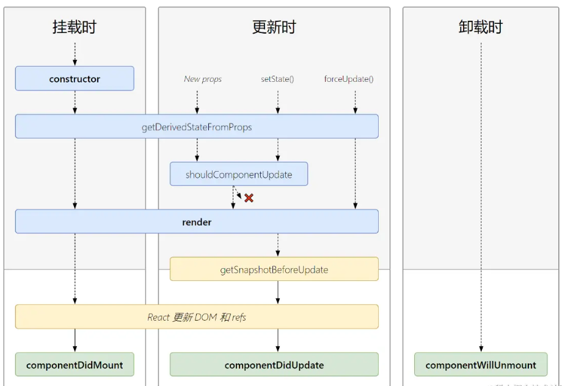

# React 知识点

## 严格模式的作用

1. 不安全的生命周期方法：某些生命周期方法在未来的 React 版本中将被弃用。严格模式会警告这些不安全的方法的使用。
2. 使用过时或遗留的 API：严格模式会警告使用过时或遗留的 API。
3. 意外的副作用：严格模式可以帮助你发现组件中可能的意外副作用。
4. 与旧版本 React 不兼容的代码：严格模式会警告你的代码中可能与未来版本的 React 不兼容的部分。

## React 和 ReactDom 两个包分别有什么作用？

1. react：这是 React 库的核心。它定义了 React 组件的创建和生命周期方法，以及 React 元素的概念。你可以将其视为 React 的“引擎”。
2. react-dom：这个库提供了在浏览器环境中使用 React 的方法，例如将 React 组件渲染到 DOM 中，或者在 DOM 中触发 React 组件的更新。你可以将其视为 React 的“驱动程序”。

## 生命周期有哪些？

- static getDerivedStateFromProps(props, state)

  - 如果你定义了 static getDerivedStateFromProps，React 会在初始挂载和后续更新时调用 render 之前调用它。它应该返回一个对象来更新 state，或者返回 null 就不更新任何内容。
  - props：组件即将用来渲染的下一个 props。
  - state：组件即将渲染的下一个 state。

- getSnapshotBeforeUpdate(prevProps, prevState)
  - render以后， 只会在更新的时候执行
  - 如果你实现了 getSnapshotBeforeUpdate，React 会在 React 更新 DOM 之前时直接调用它。它使你的组件能够在 DOM 发生更改之前捕获一些信息（例如滚动的位置）。此生命周期方法返回的任何值都将作为参数传递给 componentDidUpdate。

- 挂载时
  - constructor()
  - render()
  - componentDidmount()
- 更新
  - componentDidUpdate(prevProps, prevState， snapshot?)
- 卸载
  - componentWillUnmount()

## 为什么 setSate 有异步更新

- react 在执行 setState 后需要执行 render， diff， 更新 DOM 等一些列操作， 性能开销是比较大的。 加入异步更新，更新合并等策略能优化性能。
- setState 只在合成事件和钩子函数中是“异步”的，在原生事件和 setTimeout 中都是同步的。（react 为了解决跨平台，兼容性问题，自己封装了一套事件机制，代理了原生的事件，像在 jsx 中常见的 onClick、onChange 这些都是合成事件）

- setState 的“异步”并不是说内部由异步代码实现，其实本身执行的过程和代码都是同步的，只是合成事件和钩子函数的调用顺序在更新之前，导致在合成事件和钩子函数中没法立马拿到更新后的值，形式了所谓的“异步”，当然可以通过第二个参数 setState(partialState, callback) 中的 callback 拿到更新后的结果。

- setState 的批量更新优化也是建立在“异步”（合成事件、钩子函数）之上的，在原生事件和 setTimeout 中不会批量更新，在“异步”中如果对同一个值进行多次 setState ， setState 的批量更新策略会对其进行覆盖，取最后一次的执行，如果是同时 setState 多个不同的值，在更新时会对其进行合并批量更新。

## 什么时候是异步更新， 什么时候是同步更新

- 组件里面的事件处理程序， 比如`onClick = {handleClick}`里面的 setState 是异步更新， 生命周期函数里面的 setState 是异步更新。
- 其他地方， 比如`setTimeout` 或者`addEventListener`都是同步更新。

## 列表渲染时为什么加 key

- dom diff 的时候用于识别原有的 dom，提升性能

## 受控组件与非受控组件是什么

- `<FInput value={x} onChange={changeValue} />`受控组件： 由开发者控制状态，value 等
- `<FInput defaultValue={x} ref={input} />` 非受控组件： 不由开发者控制的组件

## 组件间的通信

- 父子组件通过 props
- 爷孙组件可以通过 Context， createContext， Provider
- 任意组件可以通过 eventBus
- 更复杂的可以通过 redux， mobx 状态管理库

## shouldComponentUpdate 有什么用

- 用于优化性能，假如不需要更新视图， 则可以返回 false 去不进行这次渲染。

## 虚拟 DOM 是什么

- vDom 就是我们写的 JSX， JSX 会返回一个对象包含了属性和孩子的数据对象， 也就是虚拟 DOM。 babel 会把 JSX 变成`Reacte.createElement`, 数据对象和将来要渲染到页面的 DOM 一一对应。

# React 的原理是什么

- babel 把 jsx 变成`React.createElement` 把 JSX 变成一个包含属性和孩子的数据对象（Vdom，通过 render 方法渲染成真正的 DOM 放在页面上，当 setState 时重新执行 render， 进行 DOM diff， 给旧 DOM 进行“补丁升级”。

## 什么是高阶组件

- 高阶组件就是一个函数， 接受一个组件作为参数， 并且返回一个新的组件。

## 用过哪些全局状态管理的框架

- redux 和 mobx

## react router

- BrowserRouter/HashRouter
- Switch 决定渲染什么
- Route 做匹配
- Link   跳转

## 如何实现组件懒加载

`React.lazy(() => import('././component.ts'))`

## 如何做组件加载过程中统一的 Loading

`<Suspense fallback={<Loading />}></Suspense>`

## React Hooks 怎么用？ useEffect 返回值？依赖值？

- useEffect
  - 不设置第二个参数的时候， 监控所有的 state 的变化。相当于 componentDidMount 和 componentDidUpdate
  - 返回一个箭头函数的时候， 用于组件卸载时执行。相当于 componentWillUnmount
  - 第二个参数不为空的时候，表示仅对该 state 进行监控。
  - 第二个参数为空数组的时候，相当于 componenntDidMount，仅仅在初始化的时候执行。
- useState 函数内组件参数。

## useLayoutEffect / useEffect

React 提供了两个钩子函数来在组件渲染之后触发副作用：useEffect 和 useLayoutEffect。

useEffect 是一个高阶函数，它接受一个回调函数作为参数，在组件渲染之后调用该回调函数，并且在组件卸载时进行清理工作。

useLayoutEffect 与 useEffect 类似，它也接受一个回调函数作为参数，并在组件渲染之后调用该回调函数，并且在组件卸载时进行清理工作。

不同之处在于 useLayoutEffect 会在浏览器更新布局之前执行，而 useEffect 会在浏览器更新画面之后执行。

这意味着 useLayoutEffect 可以在更新之前访问 DOM 节点的布局信息，而 useEffect 则需要等到浏览器更新画面之后才能访问。

因此，useLayoutEffect 通常用来处理需要立即获取 DOM 布局信息或者需要在 DOM 布局更新之前触发操作的场景，比如动画，高度计算等。

总结，useEffect 和 useLayoutEffect 都是用来处理副作用，但是 useLayoutEffect 会在浏览器更新布局之前执行，而 useEffect 会在浏览器更新画面之后执行。
