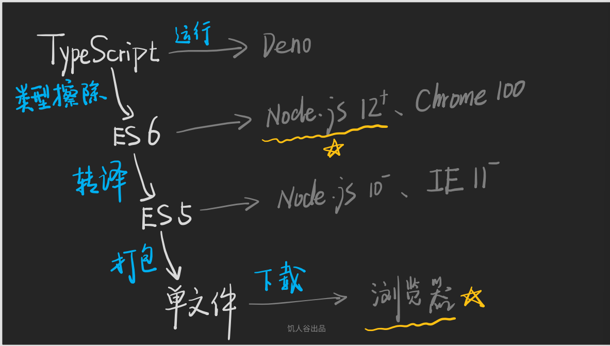

# typescript 知识点

## ts 如何运行

- 一段 js 代码可以直接运行在浏览器/nodejs 环境中， 但是 ts 需要进行类型擦除才可以运行在浏览器/nodejs，否则会直接报错。 但可以通过 deno 直接运行。
- 如果需要擦除类型，可以使用的包包含：

  - esbuild （快，不检查 ts 语法） `npm i -g esbuild`
  - swc （快，不检查 ts 语法） `npm i -g @swc/cli @swc/core`
  - tsc （慢， 会检查语法） `npm i -g typescript`
  - babel （慢， 会检查语法， 依赖多，需要在项目中运行）`npm i @babel/core @babel/cli @babel/preset-typescript`

## 类型擦除：

简单来讲就是 ts 经过类型擦除可以转化成 ES6 代码

# 数据类型

### JS / TS 类型

#### JS

- null / undefined / string / number / boolean / object / Symbol / bigint

#### ts

- 以上所有， 加上
- void / never / enum / unknown / any
- 再加上自定义类型 type / interface
