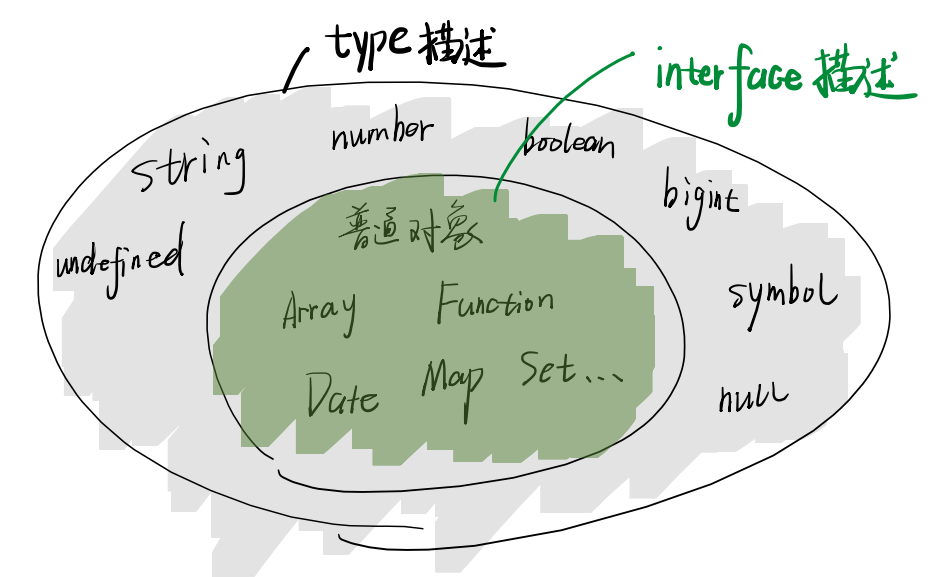

# typescript 知识点

## ts 如何运行

- 一段 js 代码可以直接运行在浏览器/nodejs 环境中， 但是 ts 需要进行类型擦除才可以运行在浏览器/nodejs，否则会直接报错。 但可以通过 deno 直接运行。
- 如果需要擦除类型，可以使用的包包含：

  - esbuild （快，不检查 ts 语法） `npm i -g esbuild`
  - swc （快，不检查 ts 语法） `npm i -g @swc/cli @swc/core`
  - tsc （慢， 会检查语法） `npm i -g typescript`
  - babel （慢， 会检查语法， 依赖多，需要在项目中运行）`npm i @babel/core @babel/cli @babel/preset-typescript`

## 类型擦除

简单来讲就是 ts 经过类型擦除可以转化成 ES6 代码


## 数据类型

### JS / TS 类型

#### JS

- null / undefined / string / number / boolean / object / Symbol / bigint

#### ts

- 以上所有， 加上
- void / never / enum / unknown / any
- 再加上自定义类型 type / interface

### 为什么有两个 number/Number | string/String | boolean/Boolean 呢？

- 因为被 js 做了一层包装对象
- `42.toFixed(2)`等价于
  ```
  let temp = new Number;
  value = tem.toFixed(2);
  delete temp
  return value;
  ```
- 所以 JS 中的 Number String Boolean 只用于包装对象
- 正常情况下 js/ts 都不用

### Object 类型

- 正常不会直接使用 object 类型在 ts
- 对象 = 普通对象

  - 数组对象 Array
  - 函数对象 Function
  - 正则对象 RegExp
  - 日期对象 Date

#### 如何在 ts 中描述对象数据类型？

1. 用 class 或者 constructor 描述
2. 使用 type 或者 interface 描述

```Javascript
//索引签名
//k可以为任意
type A = {
  [k: string]: string;
};
//等于泛型
type A2 = Record<string, number>;
```

- 结论： ts 一般使用索引签名或者 `Record` 泛型来描述普通对象

### 数组对象

```Javascript
type A = string[];

//等价于
type AA = Array<string>
```

- 结论： ts 一般使用`Array<?>`或者`string[]`或者`[string, number]`来描述数组

### 函数对象

```Javascript
type fnA = (a: number, b: number) => number;
```

- 结论： ts 一般使用`() => ?` 来描述函数

### any/unknown/never

- any 全知全能
- unknown 适合值从外部获取，不确定类型时候使用。 尽量使用这个然后自己去断言
- never 空集合不包含任何类型

### enum 枚举类型

#### 应用场景 1 数字情况

```ts
// 什么时候用enum
// 数字 初始值为0

enum A {
  todo,
  done,
  archived,
  deleted,
}
```

#### 应用场景 2 前端权限管理

```ts
enum Permission {
  None = 0, // 0000
  Read = 1 << 0, // 0001
  Write = 1 << 1, // 0010
  Delete = 1 << 2, // 0100
  Manage = Read | Write | Delete, // 0111
}

type User = {
  permission: Permission;
};

//0b开头证明这是二进制在js中
const user: User = {
  permission: 0b0010,
};

// 任何一个x 与 Permission.Write 进行与操作（&） 结果等于Permission.Write， 那证明权限拥有
// 因为 与&预算， 都是1才为1
if ((user.permission & Permission.Write) === Permission.Write) {
  console.log("user has right to write");
}
```

#### 什么时候不用 enum

- 使用 string | other 类型时， 不用 enum
- 原因是可以使用更为简单直接的写法， 可直接提示赋值

### type

- 类型别名 Type Aliases
- 给其他类型取个名字(并没有产生真的人)
- 几乎什么时候都可以用
- type 不可以重新赋值

```ts
type Name = string;
type FalseLike = " | 0 | false | null | undefined";
type Point = { a: number; b: number };
type Points = Point[];
type Line = [Point, Point];
type Circle = { center: Point; radisu: number };
type Fn = (a: number) => number;
type FnWithProp = {
  //note: 对象中声明函数不能像上面用箭头函数，要用冒号
  (a: number, b: number): number;
  prop: string;
};
```

### interface

- 用来声明接口
- 描述对象的属性(declare the shapes of objects)
- interface 自动合并

```ts
interface Date {
  [key: string]: string;
}
interface Point {
  x: number;
  y: number;
}
interface Points extends Array<Point> {}
interface Fn {
  (x: number, y: number): number;
}
```



### type interface 区别

- 区别 1: interface 只描述对象 type 则描述所有数据
- 区别 2： type 只是别名， interface 是（真名）类型声明
- 区别 3： 对外 API 尽量用 interface， 方便拓展。 对内部 API 尽量用 type, 防止代码分散

### void

- 返回空， 但是编译不会报错， 如果想要使用返回值时报错

### 联合类型 （并集 | ）

#### 举例

```
type A1 = number;
type B1 = string;

type C1 = A1 | B1;

const c1: C1 = "42";
const c2: C1 = 12;
```

```
type A2 = { name: string };
type B2 = { age: number };

type C2 = A2 | B2;

const c11: C2 = {
  name: "xxx",
  age: 61,
};
```


#### 如何使用联合类型？

假如接受一个联合类型，string | number
既不能当作 string 直接使用，或者 number 直接使用
那么怎么直接使用这个变量？

答案： 想办法区分出类型

#### 类型收窄

##### 方法 1： 使用 typeof

```
const f1 = (a: number | string) => {
  // 注意，这里只有50%几率是number / string
  // 所以不能直接使用其对应的方法， 只能使用number & string的共同方法
  // 只能想办法区分开类型

  //方法1：使用typeof
  // 也叫做类型收窄
  if (typeof a === "number") {
    a.toFixed(2);
  } else if (typeof a === "string") {
    a.toLocaleLowerCase();
  } else {
    // 注意这里是never
    // 不能对a进行任何操作
    console.log(a);
  }
};
```

- 可以得到的值包含： string / number / bigint / boolean / symbal / undefined / object / function

- 局限性：array / normal obj / date / null 都会得到 object

##### 方法 2： 使用 instanceOf

```
const f2 = (a: Date | Date[]) => {
  //方法2：使用instanceOf
  if (a instanceof Date) {
    a.getDate();
  } else if (a instanceof Array) {
    a.push(new Date());
  } else {
    // 注意这里是never
    // 不能对a进行任何操作
    console.log(a);
  }
};

```

- 局限性：
  - 不支持 string / number / boolean 等
  - 不支持独有的 ts 类型
  - 

##### 方法 3： 使用 in

```
type Person = {
  name: string;
};

type Animal = {
  age: number;
};

const f3 = (a: Person | Animal) => {
  //方法3：使用in
  if ("name" in a) {
    a.name.charCodeAt(0);
  } else if ("age" in a) {
    a.age.toString();
  } else {
    // 注意这里是never
    // 不能对a进行任何操作
    console.log(a);
  }
};
```

- 局限性：适用于部分对象

##### 方法 4： 使用 js 中的判断类型的函数区分或者逻辑

- 比如 Array.isArray 等

#### 类型谓词 is（区分类型的万全办法）

```
type Rect = {
  width: number;
  height: number;
};

type Circle = {
  center: [number, number];
  radius: number;
};


// 在你的代码中，isRect和isCircle被定义为箭头函数表达式，所以按照正常的规则，它们应该在使用之前进行定义。
// 然而，在这种情况下，由于它们被用作类型谓词（Type Predicate），TypeScript的类型系统会对其进行特殊处理。

// TypeScript允许在类型谓词的上下文中使用尚未声明的函数。
// 这是因为类型谓词的类型检查是基于形状和类型的，而不是基于具体的运行时行为。
// 所以，尽管在代码中它们被定义为箭头函数表达式，在类型检查期间，TypeScript将会将它们视为类型谓词并进行处理。

const f1 = (a: Rect | Circle) => {
  if (isRect(a)) {
    console.log(a);
  } else {
    console.log(a);
  }
};

const isRect = (x: Rect | Circle): x is Rect => {
  return "height" in x && "width" in x;
};

const isCircle = (x: Rect | Circle): x is Circle => {
  return "center" in x && "radius" in x;
};
```

- 优点： 支持所有 ts 类型
- 缺点：麻烦

#### 可辩别联合 Discriminated Unions

```
type Rect = {
  kind: "rect";
  width: number;
  height: number;
};

type Circle = {
  kind: "circle";
  center: [number, number];
  radius: number;
};

type Shape = Circle | Rect; // 这里Shape就是可辨别联合类型

const f2 = (shape: Shape) => {
  if (shape.kind === "circle") {
    console.log(shape); // Circle
  } else {
    console.log(shape); // Rect
  }
};

```

- 优点： 让复杂类型的收窄，变成简单类型的对比

- 要求：T=A|B|C|D....
  - 要求 A|B|C|D 有相同的属性（比如 kind）
  - kind 的类型必须是简单类型
  - 各类型中的 kind 可以区分（无交集）
  - 这个 T 就可以成为可辩别联合类型

### 交叉类型 （交集 &）

#### 举例

```
type A = string & number; // A 是never

type L = {
  lefthand: string;
};

type R = {
  righthand: string;
};

type C = L | R;
type D = L & R;

const d: D = {
  //  Property righthand   is missing
  lefthand: "x",
};

```

- 假如使用 type 有属性冲突，会被推断成 never， 不能赋值
- 假如使用 interface 有属性冲突，会直接报错

- 两个函数的交集， 得到一个参数的并集

#### 结论：

- 交叉类型常用于有交集的类型 A 、B
- 注意理解`type a = {name : string }` 是一个 name 为 string 的对象 A 类型，意思是这个可以包含其他任何属性在对象中， 所以并不单单这一个对象会包含在其中
- 但是赋值/第一次声明的时候， ts 会做严格检查， 也就是说第一次声明不能有额外的值在对象中

## 类型兼容与赋值

### 为什么要兼容

- 类型往往无法一致
- 你有的 我都有， 则我能代替你
- y 有的， x 都有， 则 x 兼容 y

#### 简单类型

```
type A = string | number
let a : A = 'hi'
```

#### 普通对象兼容

```
type Person = {
  name: string,
  age:number
}

let user = {
  name:"xxx",
  age: 18,
  id:1,
  email:"xx"
}

let p: Person;
p = user
```

这里 user 兼容 Person， 所以直接赋值不报错， 即使作为参数也不会报错

#### 复杂函数（函数包含参数和返回值）

##### 参数个数不同，能兼容吗？

接收两个参数的函数 = 接受一个参数的函数 （这样是 ok 的， 反之报错）

##### 参数类型不同，能兼容吗？

对参数要求少的可以赋值给对参数要求多的

##### 返回值类型不同， 能兼容吗？

返回值属性少集合大 = 返回值属性多集合小

## 对象类型语法

```
type Person = {
  name: string;
};

interface PersonInterface{
  name: string;
}

```

### 索引签名

```
type Person2 = {
  name: string;
  age?: number;
};

```

### 映射类型（多用于泛型）

```
type Hash2 = {
  [key in string]: unknown;
};
```

### ？表示可选

```
type Person2 = {
  name: string;
  age?: number;
};

```

### readonly 表示只读， 不能写

```
type Person2 = {
  readonly id:number;
  name: string;
  age?: number;
};

```

## 函数类型语法

对象的语法全部适用于函数

### 声明函数及其类型

```
//第一种， 先写类型再赋值
type F1 = (a:number, b:number) => number
const f1: F1 = (a,b) => a + b

//第二种， 先实现箭头函数， 再获取类型
const f2= (a:number, b:number):number => a + b
type F2 = typeof f2

//第三种， 先实现普通函数， 再获取类型
function f3= (this:unknown, a:number, b:number):number{
  return a + b
}
type F3 = typeof f3

//第四种， 先实现匿名函数， 再获取类型
const f4= function(this:unknown, a:number, b:number):number{
  return a + b
}
type F4 = typeof f4
```

#### 类型谓词

```
funtion isPerson(x: Person | Animal):x is Person{
  return 'name' in x
}
```

#### 可选参数

addEventListener 第三个参数

##### 参数默认值

#### 参数也可以是函数

#### 返回值也是函数

函数柯里化（redux 的 connect）

## 泛型

- ts 泛型 -> 理解为 js 的函数

```
type F<A|B> = A|B // 前面为接收参数 后为返回结果
type Result = F<string, number> // 返回一个类型， 调用F函数
```

- 不确定接受的参数是什么， 在需要用的时候才知道， 传进来的时候才知道

### extends

- 读作包含于（一个集合小于等于某个集合）

```
type LikeString<T> = T extends string ? true : false;
type LikeNumber<T> = T extends number ? 1 : 2;
type LikePerson<T> = T extends Person ? 'yes' : 'no';
```

- 规则 1： 若泛型 T 为 never， 则表达式的值为 never
- 规则 2： 若泛型 T 为联合类型， 则分开计算
- 注意 仅仅对泛型有效

### keyof

- 获取到所有 T 泛型的 key

```
type Person = {
  name: string;
  age: number;
};
type GetKeys<T> = keyof T;


type Result = GetKeys<Person> //name || age
```

### extends keyof

```
type GetKeyType<T, K extends keyof T> = T[K] // 如果不加会报错， 因为K不一定是T的key

type ResTwo = GetKeyType<Person, 'name'>
```
