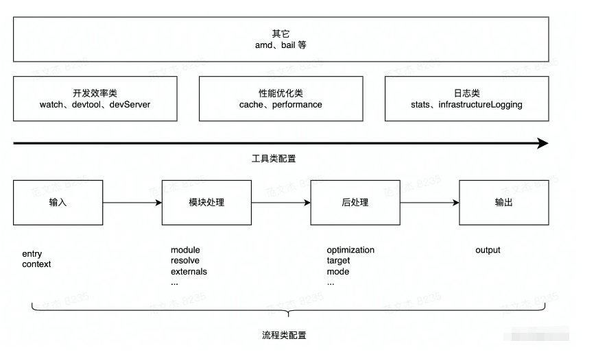
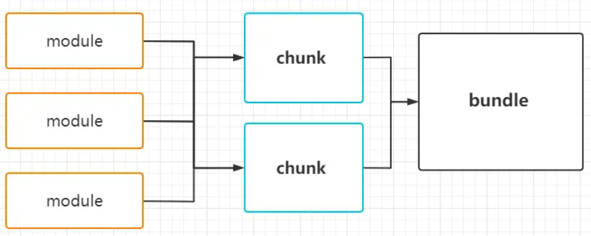

# webpack

## 复习 commonJS

### commonJS 规范

- 每个文件是一个模块（模块内部的变量， 函数， 类都是私有的， 对其他不可见）
- 在模块中使用 global 定义全局对象， 不需要导出， 在别的模块中可以直接使用
- 每个模块内部, module 变量(一个对象)代表当前模块， module.exports 属性代表当前模块对外接口
- 通过 require 加载模块， 读取并执行模块代码， 返回 module.exports 对象
- 所有代码运行在模块作用域， 不会污染全局作用域
- 模块可以多次加载， 但只会在第一次加载时运行一次， 然后缓存起来， 以后再加载就直接读取缓存
- 模块加载的顺序， 按照代码中出现的顺用于控制如何优化产物包体积序

#### module.exports 和 exports 的区别

- module.exports 初始值是一个空对象 {}
- exports 是 module.exports 的一个引用
- require() 返回的是 module.exports 而不是 exports
- exports.xxx = xxx 是在对 exports 对象添加属性， 而 module.exports = xxx 是对 module.exports 赋值
- 如果 module.exports 被赋值， exports 就不再指向 module.exports
- 一般情况下， 一个模块只能使用一种导出方式， 不能混用

### ES Module

- ES Module 是 JS 的模块化规范， 也是 JS 语言的官方标准
- ES Module 是静态的， 在编译时就能确定模块的依赖关系

### ES Module 和 commonJS 的区别

- ES Module 是编译时加载， commonJS 是运行时加载
- ES Module 输出的是值的引用， commonJS 输出的是值的拷贝
- ES Module 是异步加载， commonJS 是同步加载
- ES Module 是单例模式， commonJS 是多例模式
- ES Module 可以直接导入模块中的变量， commonJS 只能导出模块中的变量
- ES Module 可以导入模块中的部分内容， commonJS 只能导出整个模块
- ES Module 可以在编译时优化， commonJS 只能在运行时优化
- ES Module 可以在浏览器中运行， commonJS 只能在 Node.js 中运行
- ES Module 可以在浏览器中异步加载模块， commonJS 不能异步加载模块
- ES Module 可以在浏览器中预解析模块， commonJS 不能预解析模块
- ES Module 可以在浏览器中缓存模块， commonJS 不能缓存模块
- ES Module 可以在浏览器中预编译模块， commonJS 不能预编译模块

## webpack 是什么

- webpack 是一个现代 JavaScript 应用程序的静态模块打包器(module bundler)

### webpack 打包的过程

- 输入：从文件系统读入代码文件；
- 模块递归处理：调用 Loader 转译 Module 内容，并将结果转换为 AST，从中分析出模块依赖关系，进一步递归调用模块处理过程，直到所有依赖文件都处理完毕；
- 后处理：所有模块递归处理完毕后开始执行后处理，包括模块合并、注入运行时、产物优化等，最终输出 Chunk 集合；
- 输出：将 Chunk 写出到外部文件系统；

### 流程类

与打包流程强相关的配置项有：

- 输入输出：
  - entry：用于定义项目入口文件，Webpack 会从这些入口文件开始按图索骥找出所有项目文件；
  - context：项目执行上下文路径；
  - output：配置产物输出路径、名称等；
- 模块处理：
  - resolve：用于配置模块路径解析规则，可用于帮助 Webpack 更精确、高效地找到指定模块
  - module：用于配置模块加载规则，例如针对什么类型的资源需要使用哪些 Loader 进行处理
  - externals：用于声明外部资源，Webpack 会直接忽略这部分资源，跳过这些资源的解析、打包操作
- 后处理：
  - optimization：用于控制如何优化产物包体积，内置 Dead Code Elimination、Scope Hoisting、代码混淆、代码压缩等功能
  - target：用于配置编译产物的目标运行环境，支持 web、node、electron 等值，不同值最终产物会有所差异
  - mode：编译模式短语，支持 development、production 等值，可以理解为一种声明环境的短语
  - mode：development、production 区别是什么？
    - development：开发模式，开启调试功能，关闭代码压缩
    - production：生产模式，开启代码压缩，关闭调试功能

这里的重点是，Webpack 首先需要根据输入配置(entry/context) 找到项目入口文件；之后根据按模块处理(module/resolve/externals 等) 所配置的规则逐一处理模块文件，处理过程包括转译、依赖分析等；模块处理完毕后，最后再根据后处理相关配置项(optimization/target 等)合并模块资源、注入运行时依赖、优化产物结构等。
这些配置项与打包流程强相关，建议学习时多关注它们对主流程的影响，例如 entry 决定了项目入口，而 output 则决定产物最终往哪里输出；resolve 决定了怎么找到模块，而 module 决定了如何解读模块内容，等等。

### 工具类

除了核心的打包功能之外，Webpack 还提供了一系列用于提升研发效率的工具，大体上可划分为：

- 开发效率类：
  - watch：用于配置持续监听文件变化，持续构建
  - devtool：用于配置产物 Sourcemap 生成规则
  - devServer：用于配置与 HMR 强相关的开发服务器功能
- 性能优化类：
  - cache：Webpack 5 之后，该项用于控制如何缓存编译过程信息与编译结果
  - performance：用于配置当产物大小超过阈值时，如何通知开发者
- 日志类：
  - stats：用于精确地控制编译过程的日志内容，在做比较细致的性能调试时非常有用
  - infrastructureLogging：用于控制日志输出方式，例如可以通过该配置将日志输出到磁盘文件
- 等等

逻辑上，每一个工具类配置都在主流程之外提供额外的工程化能力，例如 devtool 用于配置产物 Sourcemap 生成规则，与 Sourcemap 强相关；devServer 用于配置与 HMR 相关的开发服务器功能；watch 用于实现持续监听、构建。
工具类配置内聚性较强，通常一个配置项专注于解决一类工程问题，学习时建议先对配置项按其功能做个简单分类，例如上述开发效率类、性能优化类等，之后再展开研究其可选值与效果。

## entry

- 假如希望有多个文件，就可以写这里
- 入口起点(entry point) 指示 webpack 应该使用哪个模块，来作为构建其内部依赖图(dependency graph) 的开始。进入入口起点后，webpack 会找出有哪些模块和库是入口起点（直接和间接）依赖的。

## Loaders

- webpack 只能理解 js 和 json 文件，loader 让 webpack 能去处理其他类型的文件，并将它们转换成有效的模块，以供程序使用，以及被添加到依赖图中
- loader 的两个属性： test（识别出哪个文件会被转换） use（定义在进行转换时，应该使用哪个 loader）
- style-loader 把 CSS 插入到 DOM 中。
- css-loader css-loader 会对@import 和 url()进行处理，就像 js 解析 import/require()一样。

### 常见的 loader

- file-loader：把文件输出到一个文件夹中，在代码中通过相对 URL 去引用输出的文件
- url-loader：和 file-loader 类似，但是能在文件很小的情况下以 base64 的方式把文件内容注入到代码中去
- source-map-loader：加载额外的 Source Map 文件，以方便断点调试
- image-loader：加载并且压缩图片文件
- babel-loader：让 babel 来处理最新的 js(ts、jsx)语法
- css-loader：加载 CSS，支持模块化、压缩、文件导入等特性
- style-loader：把 CSS 代码注入到 JavaScript 中，通过 DOM 操作去加载 CSS。

### 文件指纹 name 配置

- [hash] 和整个项目构建相关，只要项目文件有修改，整个项目的 hash 值 就会变化
- [chunkhash] 和 webpack 打包的 chunk 有关，不同 entry 会生成不同的 chunkhash 值， 一般 js 会使用
- [contenthash] 根据文件内容来定义 hash， 文件内容不变，则 contenthash 不变， 一般 css 会使用
面试题: hash、chunkHash、contentHash的区别？
hash: 根据webpack所有模块生成的，有任何变化重新生成，而且唯一
chunkHash： 根据chunk所有的依赖生成的，只要chunk中的依赖发生变化就会重新生成，也有问题。例如： 异步加载的组件，css js
contentHash: 根据文件来的，项目一般用这个，没有前面两种情况的问题

最佳实践总结
JS 文件：使用 [name].[chunkhash].js 或 [name].[contenthash].js，避免全局 hash。
CSS 文件：必须使用 contentHash（如 [name].[contenthash].css），确保 CSS 缓存独立。
图片 / 字体等资源：使用 [contenthash] 或 [hash]（如 [name].[contenthash][ext]）。
长期缓存策略：
第三方库（如 React、Vue）单独打包，使用 chunkHash。
应用代码使用 contentHash，确保修改一处不影响其他资源缓存。

## plugins

- 插件用于执行范围更广的任务。比如：打包优化，资源管理，注入环境变量等（目的在于解决 loader 无法实现的其他的事情）
- CleanWebpackPlugin 构建前清理/dist 文件夹。（现在推荐 output.clean 配置而不是插件）
- HtmlWebpackPlugin 为应用程序生成一个 HTML 文件，并自动注入所有生成的 bundle。
- 在默认情况下，Webpack 使用 style-loader 会将 CSS 代码以 `<style> `标签的形式插入到 HTML 文件的 `<head> `部分。但在生产环境中，这种做法存在一些弊端，比如不利于 CSS 的缓存和并行加载。MiniCssExtractPlugin 可以将 CSS 代码从 JavaScript 文件中分离出来，生成独立的 CSS 文件，这样浏览器就可以并行加载 CSS 和 JavaScript 文件，提高页面的加载速度。

### 常见的 plugin

- HtmlWebpackPlugin: 用于创建最终使用的 HTML 文件。可自动生成，也可以使用模版创建。
- UglifyjsWebpackPlugin: 用于压缩 js 文件
- TerserWebpackPlugin：用于压缩 js，更新，支持 es6 语法
- ExtractTextWebpackPlugin: 将所有的入口 chunk 中引用的 \*.css，移动到独立分离的 CSS 文件

## Loader 和 Plugin 有什么差别

Loader 直译为"加载器"。Webpack 将一切文件视为模块，Loader 让 Webpack 拥有了加载和解析非 JavaScript 文件的能力。

Plugin 直译为"插件"。Plugin 可以扩展 Webpack 的功能。 在 Webpack 运行的生命周期中会广播出许多事件，Plugin 可以监听这些事件，在合适的时机通过 Webpack 提供的 API 改变输出结果。

## sourcemap

- 在编译后的代码和源码进行一个 mapping

## devtool

- 此选项控制是否生成，以及如何生成 source map。

## webpack-dev-server

- 提供了一个基本的 web server，并且具有 live reloading(实时重新加载) 功能

## MHR

- 模块热替换，开发过程中，可以让某个模块保持状态，但是模块产生更新
- 它允许在运行时更新所有类型的模块，而无需完全刷新。

## compiler | compilation

- compiler 对象代表一个完全配置的 webpack 环境
- compilation 对象代表对版本资源的单次构建

## Webpack 的构建流程是什么

初始化参数：从配置文件和 Shell 语句中读取与合并参数，得出最终的参数；

开始编译：用上一步得到的参数初始化 Compiler 对象，加载所有配置的插件，执行对象的 run 方法开始执行编译；

确定入口：根据配置中的 entry 找出所有的入口文件；

编译模块：从入口文件出发，调用所有配置的 Loader 对模块进行翻译，再找出该模块依赖的模块，再递归本步骤直到所有入口依赖的文件都经过了本步骤的处理；

完成模块编译：在经过第 4 步使用 Loader 翻译完所有模块后，得到了每个模块被翻译后的最终内容以及它们之间的依赖关系；

输出资源：根据入口和模块之间的依赖关系，组装成一个个包含多个模块的 Chunk，再把每个 Chunk 转换成一个单独的文件加入到输出列表，这步是可以修改输出内容的最后机会；

输出完成：在确定好输出内容后，根据配置确定输出的路径和文件名，把文件内容写入到文件系统。

在以上过程中，Webpack 会在特定的时间点广播出特定的事件，插件在监听到感兴趣的事件后会执行特定的逻辑，并且插件可以调用 Webpack 提供的 API 改变 Webpack 的运行结果。

## 有哪些代码分离的方法

入口起点：使用 entry 配置手动地分离代码。

防止重复：使用 CommonsChunkPlugin 去重和分离 chunk。

动态导入：代码中通过懒加载 import().then 分离代码。

## 什么是 tree shaking

移除 JavaScript 上下文中的未引用代码(dead-code)

## 如何利用 Webpack 来优化前端性能

- tree shaking 移除 dead-code，减小文件提及
- js、css 压缩合并，图片压缩或者内联，html 压缩
- 抽离公共的 js 或者 css
- 模块懒加载

## 如何提高 Webpack 的构建速度

- 优化 loader 配置，配置 test 、 include 、 exclude
- terser-webpack-plugin，开启缓存和多进程压缩
- thread-loader 为每个 loder 开辟单独的进程
- cache-loader 给 loader 设置缓存

## 打包文件大怎么解决

- 使用生产环境
- 压缩合并
- treeshaking
- 抽离公共的文件
- 模块懒加载

# babel

## babel-loader 有什么作用

- 把最新的 JS 语法或者 JSX 转化为 ES5，需要 babel 转

## @babel/core 有什么作用

- 转换语法，需要配合插件使用

## @babel/preset-env 有什么作用

- 把最新标准的 js 转化成 es5

## @babel/preset-react 有什么作用

- 把 jsx 变成 js

## 什么是插件，什么是预设

预设就是多个插件配置在一起（带有 preset 都是预设）
插件就是 core 需要用来解析的工具
可以在 babel.rc 里面进行配置

## 其他

# 聊一聊性能优化

- 加载优化 ---文件小，数目少，压缩合并， 服务端开启 gzip， 静态资源用 CDN，服务器配置缓存）懒加载 tree-shaking 采用 HTTP2
- 渲染优化 ---repaint reflow， 尽量少的 dom 操作
- 滚动（操作）优化 ---懒加载，请求少。 节流，防抖的优化。 DOM 的复用
- 动画的优化 ---尽量 css3， 多用 transform（这里是利用显存）
- 构建（打包）的优化 ---打包时间

- 在 Webpack 配置中，MiniCssExtractPlugin.loader 和 style-loader 均用于处理 CSS，但工作方式和适用场景有所不同：
- 输出形态
  MiniCssExtractPlugin.loader：生成独立的 CSS 文件（如.css），通过 HTML 的<link>标签引入。
  style-loader：将 CSS 以<style>标签形式内联到 JS 文件中，随 JS 加载后注入 DOM。
- 加载时机
  MiniCssExtractPlugin.loader：CSS 与 JS 并行加载，利用浏览器缓存机制提升性能。
  style-loader：依赖 JS 执行，需等待 JS 加载完成后动态生成样式，可能导致页面闪烁。

MiniCssExtractPlugin.loader：推荐用于生产环境，减少 JS 体积并支持 CSS 分割。
style-loader：适用于开发环境，支持 HMR（热模块替换）实时更新样式。
兼容性
MiniCssExtractPlugin.loader：默认不支持 HMR，需配合额外插件实现样式热更新。
style-loader：原生支持 HMR，修改 CSS 后无需刷新页面即可生效。

- 文件体积
  MiniCssExtractPlugin.loader：可通过 CSS 压缩工具（如 css-minimizer-webpack-plugin）单独优化。
  style-loader：CSS 内容嵌入 JS，会增加 JS 文件体积。
  典型配置对比

开发阶段：优先使用 style-loader，利用 HMR 提升开发效率。
生产环境：建议采用 MiniCssExtractPlugin.loader，优化加载性能和缓存策略。
特殊场景：如需优化首屏加载，可结合 html-inline-css-webpack-plugin 将关键 CSS 内联，其余 CSS 分离。

面试题：module bundle chunk  的区别？

module 就是没有被编译之前的代码，通过 webpack 的根据文件引用关系生成 chunk 文件，webpack 处理好 chunk 文件后，生成运行在浏览器中的代码 bundle。
