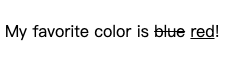

[html] 你有使用过del标签吗？说说它的用途
[css] css变量区分大小写吗？
[js] promise有哪几种状态？是如何变化的？
[软技能] 除了工作外，你为团队还做过哪些贡献？

1. `
My favorite color is <del>blue</del> <ins>red</ins>!
`

2. 区分

3. 三种状态

Pending

Resolve

Reject

基本过程：

初始化 Promise 状态（pending）
立即执行 Promise 中传入的 fn 函数，将Promise 内部 resolve、reject 函数作为参数传递给 fn ，按事件机制时机处理
执行 then(..) 注册回调处理数组（then 方法可被同一个 promise 调用多次）
Promise里的关键是要保证，then方法传入的参数 onFulfilled 和 onRejected，必须在then方法被调用的那一轮事件循环之后的新执行栈中执行。

